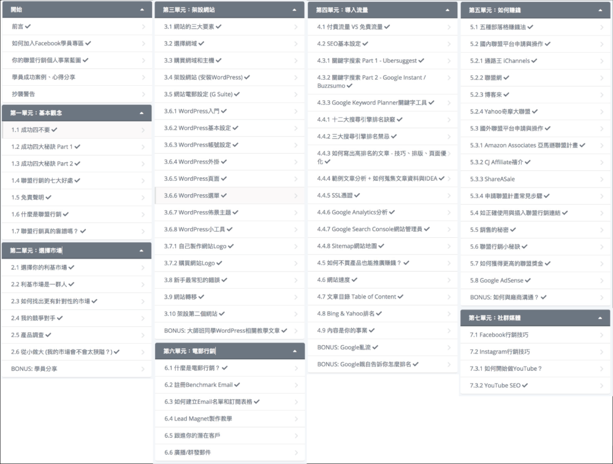

# Wordpress筆記_2020_empty

<https://www.youtube.com/watch?v=_ibSYYXyfyY>

<https://www.design-hu.com/web-news/wordpress-comparison.html>

<https://medium.com/@eddiechan/%E5%AF%AB-blog-%E5%93%AA%E5%80%8B%E9%81%B8%E6%93%87%E6%AF%94%E8%BC%83%E5%A5%BD-%E6%B7%BA%E8%AB%87-django-wordpress-%E5%8F%8A-medium-fd5a43c4e10>

<https://techmoon.xyz/wordpress-vs-blogger/>

<https://techmoon.xyz/blogspot/>

<https://www.google.com/search?rlz=1C1CHBF_zh-TWTW905TW905&ei=FN_yXrSRIPCtmAXZpbeQDA&q=wordpress+php+%E6%95%99%E5%AD%B8&oq=wordpress+php&gs_lcp=CgZwc3ktYWIQARgDMgUIABCLAzIFCAAQiwMyBQgAEIsDMgUIABCLAzIFCAAQiwMyBQgAEIsDMgUIABCLAzIFCAAQiwMyAggAMgIIADoECAAQQzoGCAAQBRAeOgUIABCxAzoFCAAQzQJQzxFYiy5g7k5oAXAAeACAAU-IAesCkgEBN5gBAKABAaoBB2d3cy13aXq4AQM&sclient=psy-ab>

<https://www.google.com/search?q=wordpress+%E6%95%99%E5%AD%B8&oq=Worldpress&aqs=chrome.2.69i57j0l5j5l2.6463j0j1&sourceid=chrome&ie=UTF-8>

<https://wpointer.com/wordpress-tutorials/wordpress-development/newbie/wix-vs-wordpress-comparison/>

<https://techmoon.xyz/blogspot/>

<https://techmoon.xyz/wordpress-vs-blogger/#%E5%B9%B3%E5%8F%B0%E7%9A%84%E6%8E%A7%E5%88%B6%E6%AC%8A>

<https://medium.com/@eddiechan/%E5%AF%AB-blog-%E5%93%AA%E5%80%8B%E9%81%B8%E6%93%87%E6%AF%94%E8%BC%83%E5%A5%BD-%E6%B7%BA%E8%AB%87-django-wordpress-%E5%8F%8A-medium-fd5a43c4e10>

<https://hahow.in/courses/5a2a6b3fa6501f001e2e9e86/assignments>

---

## the big boy can code

<https://www.notion.so/Big-Boy-Wordpress-caa7385c5bb04dcbbc87b88ad2f73a30>

<https://docs.google.com/forms/d/e/1FAIpQLSdjn45uXD1cnDMbvBlsdNPG4d1PyPTPr-dipMe7udmjMe2LfQ/viewform>

<https://docs.google.com/presentation/d/1a4SJRgdO0AXMV43cPL5S59-dgUbQuruDTWi9y6h-zXY/edit#slide=id.g8aa6b661d0_0_13>

<https://hiskio-bbcc-wp.netlify.app/>

<https://ithelp.ithome.com.tw/articles/10198775>

---

## big boy can code

2018 3 開始學程式 前端

2018 6 找到工作

2018 9 朋友外包

2018- end 接了兩個 ws 網站

## Wordpress

<https://www.facebook.com/hilivecode/videos/vb.141247613278573/1205892039752550/?type=2&theater>

### PHP 痛點 版本語法不太相同

PHP 4 即可 不需物件導向、只要學好 WS API

### Wordpress 主題開發重點

Standard Loop、 Custom Loop、 Custom Field

### WS Development KeyWords

Modern F2E(Template Language)

example. laravel blade, react jsx ...

Server Setting - VPS、Share hosting / SiteGround... ( 一年收 3000  )

Domain Setting - GoDaddy...

WS Plugins ( 熱門的 )

SEO

Security

以上都不用深入，要用知道操作過即可

### 會程式 ?

PHP 直接寫、
輕量(2-3mb)、
好抓 BUG、
Plugins 容易互相打架、
自己開發的比較知道問題、

Unicgroup Better Living

example

<https://www.betterliving.com.tw/>

<https://www.bigboycancode.com/>

<https://www.unicgroup.com/>

### 不會程式 ?

拖拉式開發 ex wix

超級肥 30mb

通常 update 就會壞

不好 debug

只能做簡單的網頁

page builder / Elementor 、 Divi Theme ( 可以去模仿看看他們怎麼寫的 )

進階 - plugin 開發要懂資料庫 php 很熟

### WS 好處 ?

門檻低 1-2 個月熟

接案 開發快/簡單 套件可以解決大部分問題 ( 防毒 表單套件 ... )

結案可收維護費

額外服務 - SEO 搬家 掃毒

<https://www.bigboycancode.com/other-services/>

避免從 0 開始 會賠工錢的

### 哪間大公司再用 WS ?

tenten

wpw.design

eg-creative

### org com ?

com 產品 給不會寫程式 不會架站 的人使用的 ( 後臺使用 wordpress )

原本是某公司內的工具，後來 open source org 版本

### 雙官方文件? 撇步

developer 工具書

Codex 專門給開發人員測試『新功能』用的發布頁面

### 套件分享

1. 搬家 all in one migration / 排程備份 updraft plus
2. SEO / Yoast SEO / Rank Math - 描述標題參數快速產生出來、優化 ( 無痕才能測試 )
3. Smart Slider ( 圖片優化 lazy loading ) 收費
4. Monster Insight GA 設定 / Facebook Chat
5. Malcare 掃毒 免費 可疑檔案是否是病毒就是要看經驗
6. WPML 多國語言 ( 多收 2 萬 )
7. ACF 頁面增加自訂欄位，自己上傳圖 ? Repeater Field

### end

課程問卷 / 優化課程
