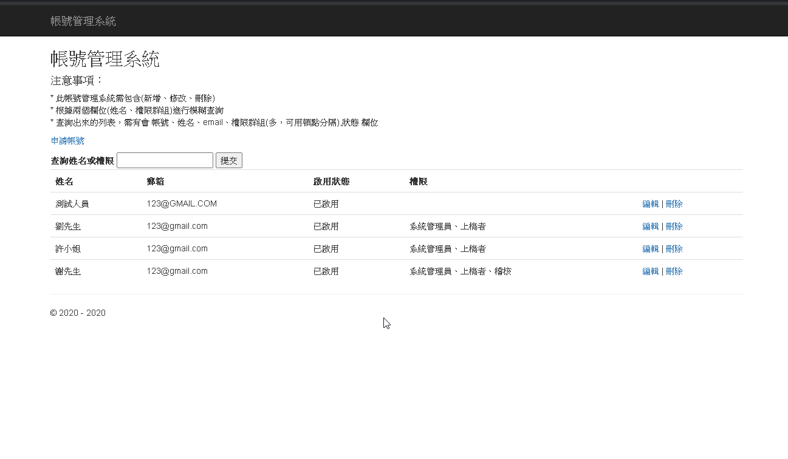
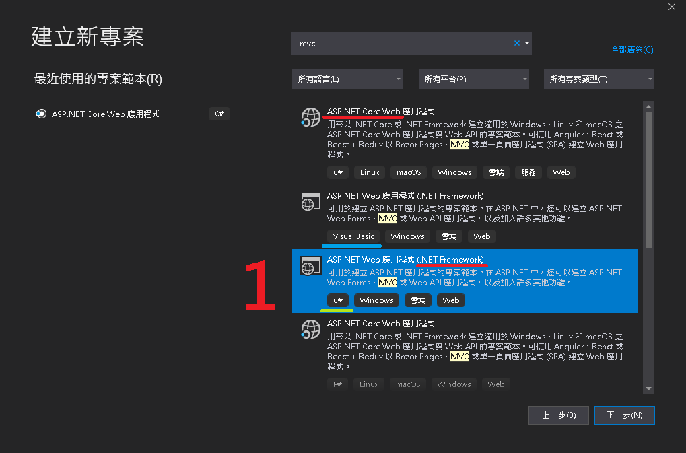
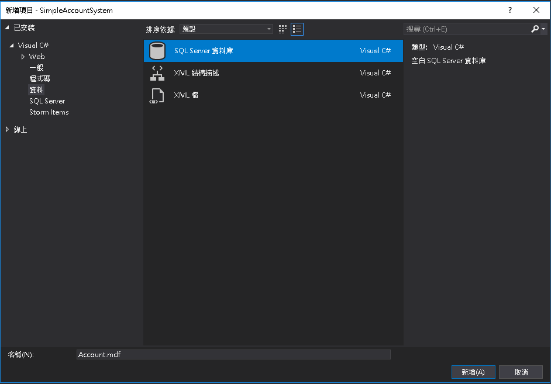
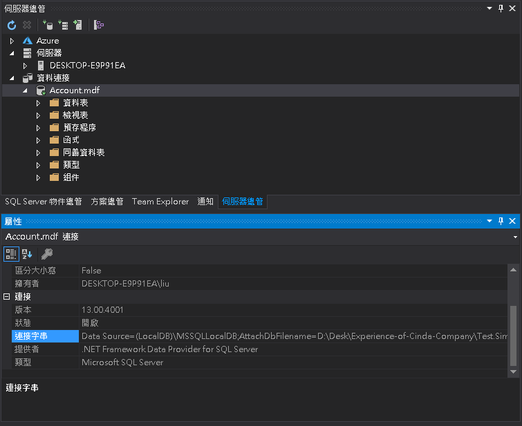
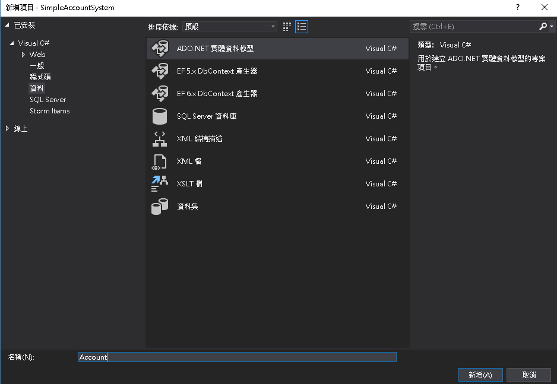
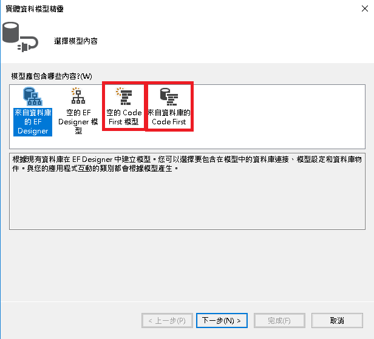
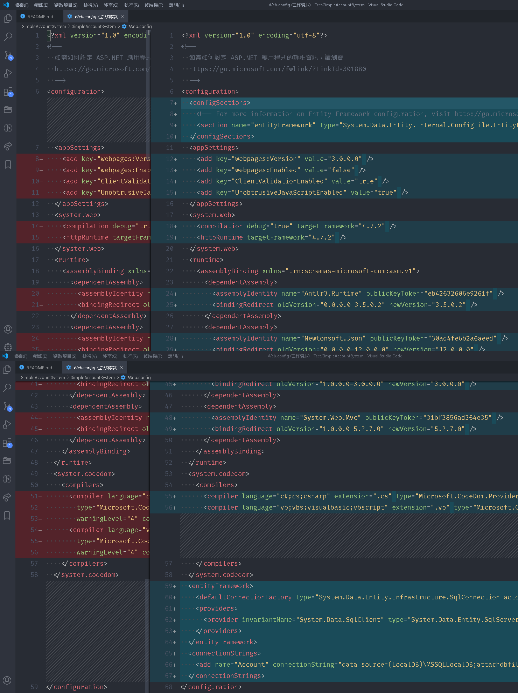
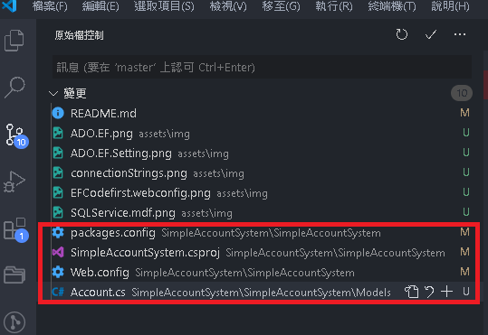
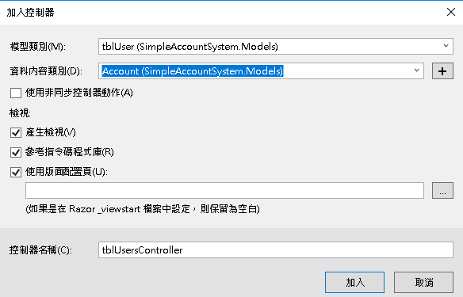

# 帳號管理系統

## code first 補充

重點為二 1. cmd 產生實際去執行更新資料庫結構的程式碼 2. 產出 sql 而不是真的由程式去更新資料庫

<https://dotblogs.com.tw/supershowwei/2016/04/11/000015>

---

2020-0803

Demo 時出現問題 mdf 檔並沒有版控，因為一開始是使用 code first from database，

流水號與預設值不知道為啥並沒有吃進 model code，

且 code first 預設沒吃到 mdf 會依照 model code 自動新增 mdf 檔案出來，

且此時如果用 SSMS 去編輯它 雖然改動了但 VS 會自動判定無此 mdf 繼續依照 model code 新增，造成檔名重複錯誤。

錯誤只在 iis 直接指定 develop 版本的程式碼時出錯， debug 模式與 指 發行版本的程式碼都不會有問題。

後來重新開了個 mdf 設定好放進 App_data 後直接用發行後再用 iis 指到發行版本內部就突然好了...

美中不足 alert 或 轉址 UI/UX 並沒有考量與用的很測體

## 使用技術

* MVC5 / Code first by database / Razor / JS / SSMS

## 功能

1. 開啟一個 Asp.net MVC 專案 :heavy_check_mark:
2. 寫一個帳號管理系統(新增、修改、刪除) :heavy_check_mark:
    * 使用者欄位(帳號、姓名、email、權限群組(可多選)(系統管理員、上槁者、稽核…) 、狀態 啟用 1 停用 0 ) :heavy_check_mark:
    * 權限群組位值，須從資料庫來 :heavy_check_mark:
    * 所有欄位都必填(需檢查) :heavy_check_mark:
    * 相同的帳號，只能註冊一次 :heavy_check_mark:
    * 註冊完成，需提示會員新增完成 :heavy_check_mark:
    * 新增、編輯、刪除需有確認提示視窗 :heavy_check_mark:
    * 根據兩個欄位(姓名、權限群組)進行模糊查詢 :heavy_check_mark:
    * 查詢出來的列表，需有會 帳號、姓名、email、權限群組(多，可用頓點分隔),狀態 欄位 :heavy_check_mark:
    * 相關資料表 :heavy_check_mark:
      * tblUser會員資訊
        * cAccount,varchar(20)，帳號 ,PK
        * cName,nvarchar(20)，姓名
        * cEmail,nvarchar(50)，Email
        * cCreateDT,datetime,註冊時間(新增當下)
        * cStatus,int,狀態(1.啟用、0.停用)
      * tblUserGroup 使用者權限
        * cAccount varchar(20),會員帳號，int,PK
        * cGroupID,int,權限群組編號，PK
      * tblGroup 權限清單
        * cGroupID,int,pk，興趣項目ID
        * cGroupName,興趣項目名稱
    * 參考畫面 根據上面提示，自行發想
3. 與資料庫聯繫，需使用EF codefirst :heavy_check_mark:
4. 建立專案，須將專案加入git版控 :heavy_check_mark:
5. 須將網站，部屬至本機端IIS上 :heavy_check_mark:

## 重點

* DataTable 動態型別，資料量大會爆
* 最好做 DTO (Class/Model)
* Model 驗證標籤
* 將多筆合併為一筆顯示

<https://dotblogs.com.tw/kevinya/2012/06/01/72553>

* EF CodeFirst
* IIS 發行
* LINQ Contains = SQL Like 模糊查詢

## 步驟

1. 首先是專案使用的語言，第一次作業時沒看清楚選擇了 VB，雖然大部分元件能共用，但編輯規則與一些細節差異還是蠻大的。(重點：C#是綠色的WWW_ICON，VB是藍色的)
2. 再來是.NET Core 與 .NET Framework 是不同的庫，用法也不太一樣，此處我們選擇舊.NET Framework Web 應用程式，因為.NET Core Web 是用注入方式起的 Console 專案需要的部分要額外引入，可能要實作的部分較多先不考慮。
3. 起完專案後首先設定 .gitignore。

   <https://stackoverflow.com/questions/42725864/dotnet-mvc-5-gitignore>

   

4. 請你輸入檔名坑 - 只要把檔名輸入成 .gitignore.。

   <https://blog.miniasp.com/post/2017/01/01/Create-gitignore-editorconfig-from-Windows-Explorer>

5. 新增App_Data內本地 mdf 作為練習用途 db。

   <https://blog.darkthread.net/blog/app-data/>

   <https://dotblogs.com.tw/yc421206/2014/01/21/141824>

   

6. 看教學要手動在 Web.Config 增加連線字串，但已經是幾年前的使用情境。所以改另一種方式，直接嘗試 Code first 與 Code first form database

   
   
   
   > 來自資料庫的 Code first ： 根據現有資料庫建立 Code First 模型。您可以選擇要包含在模型中的資料庫連接、模型設定和資料庫物件。

7. Code first from Database 可以讓你先用 SSMS 將資料庫結構搞定後再產第一次，EF Code 可能可以多次更新利用 cmd 但目前不確定。
8. 新增後 Web.config 會自動增加 configSections entityFramework 與 connectionStrings。

   

9. Code first 與 Model first / Database first 最大差別好像就是不會增加 Entity 資料模型檔案 edmx

   

10. 所以此處我們先使用 SSMS 將資料庫用 GUI 處理較快，再進行一次 Code first form database，後續要更改 EF 再用 cmd 更新資料庫。

    <https://kevintsengtw.blogspot.com/2013/10/aspnet-mvc-entity-framework-code-first.html>

11. 遇到奇怪問題，先跳過後續有機會在處理，SSMS 無法抓到 Desk 所以連專案的 App_data 都過不去，權限開了也一樣...

    <https://www.thinbug.com/q/19297097>

12. 直接移動到 D 槽最上層，修改完後再擺回 Desk / App_data => 後續給完 USERS 完全權限 Desk 就出現了。
13. 建完 DB 後直覺分析一下簡單的結構，首先是藉由 UserGroup 表串接 User 與 Group 兩張表，代表說今天要新增時，必須先新增 User 與 Group 才能去新增 UserGroup，而刪除時則要反著來，先刪除 UserGroup 後才能去刪除 User，而 Group 權限大多數時間應該都是固定的。
14. 一樣在執行一次剛剛的 Code first from database 但 SSMS 必須先卸離 mdf。這次應該會將 SSMS 設定的設定的 Data Annotations 資料批註 (標籤) 預設出來，後續要更改再參照著改即可。(以下是官方文件關於 Data Annotations)

    <https://docs.microsoft.com/zh-tw/ef/ef6/modeling/code-first/data-annotations>

15. 補充：ADO.NET 與 ADO.NET Entity Framework 差異。

    <http://www.kangting.tw/2019/06/entity-framework_23.html>

16. Code first from database 似乎不是用 Data Annotations 來控制 fk 關聯，可能是用另外一個 Fluent API ...，目前不異動 db 結構就先繼續做下去有時間在解答。

    <https://docs.microsoft.com/zh-tw/ef/core/modeling/>

    <https://dotblogs.com.tw/supershowwei/2016/04/11/000015>

17. 接著把重點放到 Account.cs ，裡面的表都是用 DbSet 類別建置。

    > DbSet：表示可用于创建，读取，更新和删除操作的实体集。

    <https://blog.csdn.net/lnazj/article/details/79066192>

18. 如何使用呢? (大重點) 此處並沒有說不允許直接使用，控制器添加具有檢視、使用 EF 的 MVC5 控制器，所以我們直接 GUI 新增後再更改。
19. 根據剛剛的分析結構與需求，目前第一步是 顯示 Details，此頁面必須包含以下功能。
    * 查詢出來的列表，需有會 帳號、姓名、email、權限群組(多，可用頓點分隔),狀態 欄位
    * 根據兩個欄位(姓名、權限群組)進行模糊查詢
20. Detail 會用到全部三張表的內容，且權限群組會多值組成一個新 column，此處好像可以用 2 種方式處理，第一種 DataTable 相關組件去組顯示值再丟到 View，第二種則是做 DTO (Class/Model) 數據傳輸物件。第一種聽說是因為動態型別，所以資料量大時會爆但確實處理上會比較快，所以可能會兩種方法都嘗試看看，但先以第二種優先。
    <https://www.petekcchen.com/2010/12/how-to-use-data-transfer-object.html>
21. 所以以 User Table 作為控制項主體再去處理第 20 項問題。

    

22. 完成第一步驟，更改 App_Start/RouteConfig.cs/將預設改為 tblUsers View 畫面。
23. 接著先進行一次版控，嘗試操作 vscode 的 git 介面，相對於 sourceTree Gui 較不直覺，但看字還是能處理。
24. 接著回到 tblUsersController.cs 這邊可以發現跟以下 dotNET Core 專案使用的元件是類似的，但 Core 是用注入進來的方式。

    <https://ithelp.ithome.com.tw/articles/10196856>

25. 利用伺服器總管先在 Account.mdf 新增一些假資料，方便做 DTO 顯示的測試。
26. DTO

    <http://dog0416.blogspot.com/2017/11/cvisual-studio-class-and-object.html>

27. Razor

    <https://ithelp.ithome.com.tw/articles/10160185>

28. 26、27很順的做過去主要是改 tblUsersController 與 tblUsersView，做完有空再補 DataTable 版本
29. 接著先做查詢需求，要研究 LINQ Contains = SQL Like 模糊查詢。
    * 根據兩個欄位(姓名、權限群組)進行模糊查詢

    <https://www.w3schools.com/tags/tag_label.asp>

30. MVC ActionResult 所有方法。

    <https://melayogu.pixnet.net/blog/post/313873726-%5Basp.net-mvc%5D-actionresult-%E5%9B%9E%E5%82%B3%E5%80%BC%E5%9E%8B%E5%88%A5>

    <https://www.thinbug.com/q/4743741>

31. 回想起以前寫 MVC 時的內容，像是 Controller 內的 Post Get 複寫，這樣才能在查詢後返回同一個 View，並請 View 要指定回傳的 ViewName。

    <https://dotblogs.com.tw/BerryNote/2016/08/26/000310>

    <https://dotblogs.com.tw/am940625/2015/03/31/150899>

32. 接著是如何用 LINQ 寫 SQL LIKE。

    <https://dotblogs.com.tw/terrychuang/2012/04/05/71297>

33. 搜尋這邊遇到一些資料處理的小問題搞了快一個小時... 最後搞好了再 git 一個版本上去，以後要看轉版本看程式碼即可。
34. 接著要搞最後一 part CUD ，打算整理一下把 CU 寫在一起。
35. 接著首先研究 Html.Dropdownlist / Html.CheckBoxFor

    <https://stackoverflow.com/questions/16688170/asp-net-mvc-html-checkboxfor>

    <https://kevintsengtw.blogspot.com/2011/07/aspnet-mvc-htmlhelper-checkboxlist-1.html>

    <https://dotblogs.com.tw/JesperLai/2018/03/20/174018>

    <https://ithelp.ithome.com.tw/articles/10186515>

36. 止血時間，35太花時間了改為 Razor 條件式加上普通的 html，並測試 @Html.ValidationMessageFor 會不會觸發。

    <https://www.w3schools.com/tags/att_input_type_checkbox.asp>

    <https://www.w3schools.com/tags/tag_select.asp>

    <https://www.w3schools.com/tags/att_input_checked.asp>

    <https://blog.miniasp.com/post/2010/10/14/LINQ-to-SQL-Query-Tips-INNER-JOIN-and-LEFT-JOIN>

37. EditView 成功 目前進入尾聲

    <https://stackoverflow.com/questions/43753977/how-to-display-an-alert-message-from-cshtml-view-asp-net-mvc>

    <https://kevintsengtw.blogspot.com/2012/09/aspnet-mvc-javascript-alert.html>

    <https://www.w3schools.com/jsref/jsref_foreach.asp>

    <https://www.w3school.com.cn/htmldom/met_form_submit.asp>

    <https://docs.microsoft.com/zh-tw/dotnet/csharp/how-to/parse-strings-using-split>

38. User Table 新增，並且同時也必須要將 UserGroup 一併新增。
39. 晚上 11:56 終於完成... 再推一版有空再補紀錄。

## 參考

<https://dotblogs.com.tw/mileslin/2016/07/28/184421>

<https://kevintsengtw.blogspot.com/2013/10/aspnet-mvc-entity-framework-code-first.html>

<https://dotblogs.com.tw/supershowwei/2016/04/11/000015>

<https://dotblogs.com.tw/mileslin/2016/08/06/232019>

<https://docs.microsoft.com/zh-tw/ef/ef6/modeling/code-first/data-annotations>

<https://dotblogs.com.tw/yc421206/2014/01/21/141824>

<https://blog.darkthread.net/blog/app-data/>

<https://www.thinbug.com/q/19297097>

<http://hk.uwenku.com/question/p-vcbynqlp-yr.html>

<https://dotblogs.com.tw/wasichris/2014/11/14/147307>

<https://ithelp.ithome.com.tw/articles/10196856>

<http://dog0416.blogspot.com/2017/11/cvisual-studio-class-and-object.html>

<https://www.itread01.com/content/1535020687.html>

<http://lesliechang-blog.logdown.com/posts/251778>

<https://dotblogs.com.tw/terrychuang/2012/04/05/71297>

<https://dotblogs.com.tw/chentingw/2016/01/01/152432>

<https://dotblogs.com.tw/JesperLai/2018/03/20/174018>

<https://www.coder.work/article/970096>

<https://dotblogs.com.tw/mileslin/2015/11/03/153788>

<https://cloud.tencent.com/developer/ask/65297>

<https://kevintsengtw.blogspot.com/2011/07/aspnet-mvc-htmlhelper-checkboxlist-1.html>

<https://ithelp.ithome.com.tw/articles/10186515>
