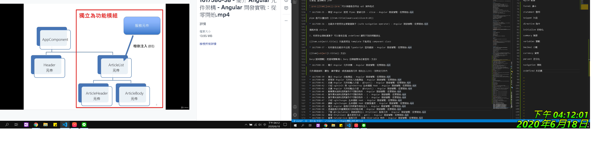
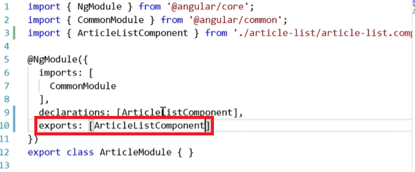

# 2020_0617 - 看的進度太慢了只好回家也看

## 此教學 ng cli 版本為 1.7.1、ng 版本為5.2.6、node 9.5.0，目前 ng cli 最新版本為 10.0.0 / 2020.06.17

* web search - Chocolatey

( Windows )套件管理器 可以一次大量安裝速度非常快

* cmd - npm i -g @angular/cli

安裝 Angular Command-Line Interface

* cmd - ng -v

確認版本與是否安裝完成

* VSCode - Angular Extension Pack

保哥出品必屬精品

* cmd - mkdir fileName

創建資料夾

* cmd - fileName>dir

資料夾詳細內容

* cmd - ng new projectName

第一次安裝會執行 nvm init 時間較久

* npm start

會執行 ng serve 命令開啟小型伺服器

* cmd - ctrl+c

终止程序的执行

* cmd - code .

使用 vscode 開啟此資料夾

* angular-cli.json

ng cli 6 設定檔更名

* .editorconfig

編輯器設定檔

* .gitignore

忽略版控設定檔

* package.json -> scripts

設定 angular 會用到的命令腳本

* protractor.conf.js

end to end testing 的設定檔

* tsconfig.json

Typtscript 設定檔

* tslint.json

tslint (檢查程式碼品質) 規則設定檔

* node_modules.file

npm packages module

* e2e.file

存放 End to End 測試檔

* sre.file

source code 存放處，內部資料結構依照 ng 官網的 style guide 指引

* sre.file > app.file

應用程式主檔

* sre.file > index.html

SPA 應用程式唯一進入點

* sre.file > style.css

主要 global style

* sre.file > main.ts

主要 global ts 進入點，ng 官方建議使用 typescript 開發，會去找 app.module，再去找 app.component 作為根模組與根元件與根模板、根樣式表、根單元測試檔

* sre.file > assets.file

資產靜態檔案 js library、jq、css、img...

* sre.file > assets.file > .gitkeep

保持在空資料夾進入版控的檔案

* sre.file > environments.file

環境變數，包含 prod 版本的 build，與開發時期的版本

* sre.file > favicon.ico

瀏覽器 icon

* sre.file > polyfills.ts

支援舊版本的加強模組，內部註解有寫使用時機與需要安裝的套件

* sre.file > test.ts

單元測試 karma.conf.js 測試檔

* sre.file > tsconfig.app.json

繼承上一層 tsconfig.json 可以額外針對 app.file 內的 ts 寫一些定義

* sre.file > tsconfig.spec.json

單元測試設定檔

* sre.file > tsconfig.d.ts

額外的 ts 的型別定義，例如要將 jq 引入可在此設定一些全域變數， `declare var $: any;`

---

vscode - f1 控制命令所有功能

vscode - ctrl+~ 開啟命令視窗

vscode - 目錄視窗斜體字是檔案呈現預覽模式

vscode - 最底下藍條，為一些特殊功能，最重要的是編輯錯誤或異常程式碼時左下角會顯示驚嘆號或叉叉。點下後會出現錯誤提示列表可以進行更詳細功能 debug 。

---

## 目的：應用程式開發，由 Google 主導並由社群共同餐與框架發展

ng1 = ngJS != ng2+

ng2+ 以上版本皆相容架構都一樣透過命令 ng update 即可無痛升級，不同的是要稍微改一下路徑或 npm 安裝相依 package。

---

## 優勢

### 跨平台

PWA - Progressive Web Apps (Angular Mobile Toolkit)

Desktop Apps - 搭配 Electron 跨 OS ( Windows / Mac / Linux )

Native Apps - ( lonic Native / NativeScript / React Native (ng 可以將 view 抽離) ) 跨平台原生應用程式

### 速度與效能

AOT 將元件範本預先編譯 JS

Universal SSR 首頁伺服器渲染，支援(Node.js / .NET / PHP ...)

Code Splitting 延遲載入，透過元件路由機制，使用者只載入需要的原始碼

偵測變更比 ng1 快 10 倍

更小 library size

範本編譯：支援預先編譯

渲染速度比 ng1 快 5 倍 ( render & re-render )

### 生產力提升

更簡潔的語法 比 ng1 移除 40+ directives

Angury

更清晰的專案結構與可維護性

Templates

ng cli

ide

### 完整開發體驗

Testing： karma 執行單元測試、protractor執行 E2E 測試。

Animation： API 處理動畫。

Accessibility： ARIA-enabled 元件 a11y 測試基礎架構可及性應用程式

---

### ng 官方建議開發語言 TypeScript / Dart

es5 > es 2015 > es 2016 > es 2017 > TypeScript2 超集合 皆可編譯建置為 JS

所以學 TS 並不會很厲害，真的要學的是 es5 ~ es2017+...

<https://www.typescriptlang.org/docs/handbook/typescript-in-5-minutes.html>

<https://www.typescriptlang.org/play/index.html?ssl=1&ssc=1&pln=2&pc=22#code/MYGwhgzhAEDKAuBXAJgUwHb2gbwFDQOgDNEQQA5MAW1QC5oJ4AnAS3QHMBufQ4Ae3SMmiYPD5MAFAAdEAIxAtgxFk0aUa9IW3YAaaDPmLoVFsmQhUASXQt4LMCE3NtegwqXg11Og2ccAlDg8hITwABYsEAB0JGTqqNAAvMqq8PHQANTQAEQ5mcam5lY2dg75ublZnmne3CEAvriNuGzwqExEYMAJAArtEAJBIUQqXhq+rBx1hNXxTpNcTbi4JOiiLIPsTKiobZJS-QL0faoCgXgh20hM6DkAEqhkfHqV+ofoMaM1NOV5WQenD6zWpLXAWLCICDtJLQdCoADucCQaEwEmyACkwHDsi8ALJRHE5ACqUKY2X83FwyD4wEQNEwUVkfGQAE8om0AB7wADCAjamBhWx2ewkkPaFKAA>

---

## NG 應用程式組成

模組 AppModule 包含許多 (元件 AppCompontent、ChildCompontent、ServicesCompontent、PipeCompontent...)。用於封裝元件

## ng 頁面組成

元件 AppCompontent 包含 (樣板+樣式)


以往 jQ 都是直接操作 DOM 但 ng 進入一個頁面基本上只有 script 再藉由 js 將一個個 module 、 compontent 渲染出來，可以更專注於處理頁面商業邏輯與可維護性提高。

---

## ng cli 原理

cmd - npm start

cmd - ng serve 透過 webpack build bundle 的程式碼

打開 url 右鍵顯示原始碼會看到 body 只包含 app root directive 根元件與引入剛剛 bundle 的 js 檔案

啟動流程後根元件會被動態插入 DOM，這時使用 F12 進入 dev loop 即可看到。

但 index.html 裡面並沒有這些 bundle 的內容？ 其實 ng serve 這句指令同時也動態的修改了 index.html

接著下一個重點是，js 從哪開始從哪匯入呢？ main.ts 內載入環境變數後啟動模組，按 f12 進入到 app.module.ts

會看到宣告此 app.module 類型為 class 且有被 export 出來，透過 directive 宣告此類別為 @NgModule

@NgModule 內 parameter 參數包含像是

declarations 宣告與 view 有關的原件

imports 用來匯入這個模組會用到的其他模組

providers 註冊一些服務的提供者

bootstrap 啟動根元件 app component 按 f12 進入 app.component.ts

可以看到此 app.component 類型也是個 class 且有範例屬性參數，且透過 directive 宣告此類別為 @Component

@Component 內 parameter 參數包含像是

selector 選取器在網頁中找到一個同樣搜尋邏輯(標籤/類別/ID)的標籤，並把標籤內容修改為此元件執行後的結果。預設的 tslint package 會根據 ng guide 在寫錯時報錯，預設希望以標籤選擇器編寫。

templateUrl 指這個元件的 HTML Template 所在之處。可以寫 inline。

styleUrls 指這個元件的 CSS 所在之處。可以寫 inline。且預設不會與其他元件衝突。

---

## ng cli 應用

cmd - ng generate component 元件名稱。

cmd 會顯示 e.g. 建置 四個檔案分別是 (元件 ts、元件 css、元件 html template、測試 spec ts)、更新 一個檔案 module 的 import 引入與 declarations 宣告。

module 引入後，如要顯示這個新元件，只要將選擇器 tag 名稱，插入根模板內即可渲染出來。

cmd - ng generate -h 顯示目前 ng 版本所有可以生成的元件類型。

action 對著 templateUrl 按 alt+o 可以開啟 目標位置檔案。

如要移除元件必須要手動移除包含 file 與引入的 code。

速簡寫指令 cmd - ng g c 元件名稱。

---

## ng 靜態檔案加入

.angular-cli.json > apps 所有應用程式都註冊在這裡

在 assets 補上需要加入的靜態 fileName

## 靜態網頁轉為 ng 應用程式

SRP 只有 index.html 擁有 head tag 所以需要將靜態網頁的內容分開搬移，

需要注意到的是 index.html > head > `<base href="/">` 可以決定整個 Url 預設是以什麼為基礎，必須保留不可覆蓋。

必須將複製過來的 head meta data 至於 base tag 之下以面遇到有檔案找不到的狀況。

ctrl+e 可以直接搜尋文件名稱不必從目錄翻找。

接著將 body 之間的 html tag 置入 app root template 中，

報錯只要開啟 dev tool Console 觀看進行 debug 即可。

## 建置發行部屬

cmd - ng build 會將 ng app build 至 dist 轉為純前端 html css js 與一些靜態檔案的包裹，放上 web server 可直接執行。

f1 wrap 可以切換自動換行。

cmd - ng build --prod 可以進一步將檔案包壓縮至最小

dir fileName 查詢檔案大小

[直接在終端機輸入其他 shell 名字即可直接切換 e.g. cmd](https://medium.com/@jackaly9527/%E7%9A%AE%E6%AF%9B%E7%AD%86%E8%A8%98-%E5%A6%82%E4%BD%95%E5%9C%A8vs-code%E4%BD%BF%E7%94%A8%E5%A4%9A%E7%A8%AEshell%E6%96%BC%E7%B5%82%E7%AB%AF%E6%A9%9F%E4%B8%8A-f89ce1e59fea)

---

## ng 升級至新版

* cmd - ng update

修改 package.json 套件版本，接著 npm update

* cmd - npm list -g --depth=0

全域觀看 packages 第一層的資訊

* npm outdated -g

全域查詢 packages 是否是最新版本

<https://update.angular.io/>

最好兩三個禮拜更新一次，避免後續累積太多技術債，且也能體驗到最新版本的內容。

---

## 資料繫結

* 內嵌 (interpolation)

{{property}}

單向把值從 component 元件內傳遞至 template。位置可以在 Tag Text 也可以在 Attribute value

* 屬性 (Property Binding)

[property]='statement'

[DOM property 與 HTML Attribute 是不一樣的](https://www.w3cplus.com/javascript/dom-attributes-and-properties.html)，HTML5 擴充 data-Attribute，這時綁定自定義 HTML Attribute 會報錯。

dev tool > Elements > Properties 並不會有自定義的 data-Attribute ，而會是原始 tag 的 HTML Attribute。需要再擴充前加上 attr.data-Attribute 才能正確綁定。

<https://codertw.com/%E5%89%8D%E7%AB%AF%E9%96%8B%E7%99%BC/26913/#outline__1>

* 事件 (Event Binding)

(event)='someMethod($event)'

* 雙向 (Two-way Binding)

[(ngModel)]='property'

---

f1 format 或 shift+alt+f 資料格式化

## 沒看的影片待補

* 1617580-17 - 學習資料繫結方法：屬性繫結 (Property Binding) - Angular 開發實戰：從零開始.mp4
* 1617580-18 - 學習資料繫結方法：事件繫結 (Event Binding) - Angular 開發實戰：從零開始.mp4

onclick => on-click = "撰寫在 export 的屬性或方法"

onclick => (click) = "撰寫在 export 的屬性或方法"

* 1617580-19 - 學習資料繫結方法：事件繫結 - 使用 $event 參數 - Angular 開發實戰：從零開始.mp4

$event 取得事件的詳細資訊

console.log 出來看 event 裡面有啥可用的屬性

target 就是觸發 event 的 tag dom

$event.altKey ...

* 1617580-20 - 學習資料繫結方法：事件繫結 - 使用具有型別的 $event 參數 - Angular 開發實戰：從零開始.mp4

typescript 中 $event 是可以綁定型別的，這樣 $event 就具有 最強開發神器 vs 的提示，較不會因為 javascript 有判別大小寫出問題。

也可從 template 直接傳入 $event.altKey 參數，後端接值即可，也可幫參數下型別 一樣會有提示。

要用哪個用法依照好維護或可擴充做取捨。

* 1617580-21 - 學習資料繫結方法：雙向繫結 (Two-way Binding) - Angular 開發實戰：從零開始.mp4

ng 是利用 FormsModule 表單模組達成雙向繫結的，所以要到 ctrl+e 、app.module.ts

import statement @angular/forms

[(ngModel)]="撰寫在 export 的屬性或方法"

效能會較差但很方便

可以利用保哥套件 a- snipper

ctrl+. 快速開起小燈泡

* 1617580-22 - 認識範本參考變數 (Template reference variables) - Angular 開發實戰：從零開始.mp4

`#tVarName` 設置後可以直接存取 DOM 類似 DOM 命名容器的感覺

F1+reload 參考bug 有時會報錯必須重啟才能解除

如果將 `#tVarName` 置於 component 上則是代表著 元件命名容器，可以存取到該元件內的屬性值

再藉由事件繫結，將任意 DOM 屬性 傳回元件類別當中

範本變數只能在目前元件的範本內使用 元件內是吃不到的 必須透過進階技巧 ?

* 1617580-23 - 學習 Angular 元件型指令 (Component Directives) - Angular 開發實戰：從零開始.mp4

元件指令 `<app-root></app-root>`含有樣板的指令

屬性指令 NgStyle 、 NgClass

結構指令 ngIF、ngFor... (NgSwitchDefault 與 NgSwitchCase 前面要補 * 、 NgSwitch 前不用)

template `` es6 樣板字串語法 可以將 template 放入 component 內共同編輯

styleUrls 是吃陣列屬性，可以吃很多個 css 檔案 !import

但 ng 動態注入屬性時會將 元件樣式表額外增加屬性選擇器所以元件樣式表只會套用在元件內

encapsulation: ViewEncapsulation.None 使元件內樣式表不參予封裝，所以有辦法蓋過權重比他大的樣式表

* 1617580-24 - 學習 Angular 屬性型指令 (Attribute Directives) - NgStyle - Angular 開發實戰：從零開始.mp4

ngModel / NgStyle / NgClass 這種指令會修改元素外觀或行為

a-NgStyle+tab

[NgStyle]="{'font-size':(12 + counter) + 'px'}"

[NgStyle]="getStyle()"

[style.font-size]="(12 + counter) + 'px'"

[style.color]="'red'"

* 1617580-25 - 學習 Angular 屬性型指令 (Attribute Directives) - NgClass - Angular 開發實戰：從零開始.mp4

[NgClass]="{'highlight': counter % 2 == 0}"

[class.highlight]="counter % 2 == 0"

* 1617580-26 - 學習 Angular 結構型指令 (Structural Directives) - NgIf - Angular 開發實戰：從零開始.mp4

a-ngIf => *ngIf="counter % 2 == 0"

星號是結構型指令專屬的語法，類似語法糖，透過 a- 比較不容易出錯

是真的刪除 dom 而不是 隱藏 display none ， 所以內部的 counter 狀態值並不會保留而是直接 initialize

* 1617580-27 - 學習 Angular 結構型指令 (Structural Directives) - NgSwitch - Angular 開發實戰：從零開始.mp4

a-NgSwitch

[NgSwitch]="counter % 2"

*ngSwitchCase="0"

*ngSwitchCase="1"

*ngSwitchDefault="0"

ng-container 可以替代結構型指令時產生的額外 tag

* 1617580-28 - 學習 Angular 結構型指令 (Structural Directives) - NgFor - Angular 開發實戰：從零開始.mp4

a-ngfor

*ngFor="let item of data"

data 資料來源 item 為區域變數

data 內的資料會依序的放入 item

內部就要套用到屬性、內嵌繫結

[href]="item['xx-xx']"

所有的 DOM 都包含 屬性 [innerHTML]="item.summary" 只要把 HTML String 繫結即可，

排處顯示 html text 的問題，且 ng 已經做到 xss 防護不准 text 內出現 script 內容，在 dev tool 會出現警告

套用 序列id *ngFor="let item of data; let idx=index"

id="post{{idx}}"

* 1617580-29 - 學習 Angular 使用 Pipes 管線元件 - uppercase 與 lowercase - Angular 開發實戰：從零開始.mp4

{{ variables | pipe }} 把變數丟給 pipe 處理完後再回來，並提供了一些內建 pipe 不夠用時在自訂即可

uppercase lowercase

* 1617580-30 - 學習 Angular 使用 Pipes 管線元件 - number - Angular 開發實戰：從零開始.mp4

<https://angular.io/api?type=pipe>

Decimal pipe

* 1617580-31 - 學習 Angular 使用 Pipes 管線元件 - currency - Angular 開發實戰：從零開始.mp4

currency 貨幣

* 1617580-32 - 學習 Angular 使用 Pipes 管線元件 - percent - Angular 開發實戰：從零開始.mp4

percent 百分比

* 1617580-33 - 學習 Angular 使用 Pipes 管線元件 - date - Angular 開發實戰：從零開始.mp4

date 日期

* 1617580-34 - 學習 Angular 使用 Pipes 管線元件 - json - Angular 開發實戰：從零開始.mp4

任意值 直接轉為 json

`<pre>{{item|json}}</pre>`可以偵錯是否符合 api 資料格式

* 1617580-35 - 學習 Angular 使用 Pipes 管線元件 - slice - Angular 開發實戰：從零開始.mp4

pipe 是可以疊加的 {{item.title|lowercase|slice:0:20}}

* 1617580-36 - 在範本中使用安全導覽運算子 (safe navigation operator) - Angular 開發實戰：從零開始.mp4

選起來後 ctrl+d

?. 利用安全導航運算子 可以避免空值 undefined 讀取不到的問題發生

{{item.subject?.title}} 只能使用在 template 不能用在 component class

* 1617580-37 - 如何避免在範本中出現 TypeScript 型別錯誤 - Angular 開發實戰：從零開始.mp4

{{item[subject]?.title}} 方法1

$any(區域變數) 把區域變數傳入 $any 回傳會變為任意型別，方法2

* 1617580-38 - 簡介 Angular 元件架構 - Angular 開發實戰：從零開始.mp4

元件溝通資料，屬性、事件繫結，或透過服務元件 相依注入(DI)，到特定元件內



* 1617580-39 - 建立 Angular 功能模組 - Angular 開發實戰：從零開始.mp4

cmd - ng g m moduleName

要手動將新 module 匯入 imports AppModule

cmd - ng g m moduleName -m otherModuleName

自動匯入

* 1617580-40 - 將現有 Angular 元件加入功能模組 - Angular 開發實戰：從零開始.mp4

cmd - cd /src/app/moduleName

cmd ng g c xxx-xxx

會幫忙註冊至 module

元件必須從 功能模組中 exports 出來，不能只是註冊 declaration ，不然 元件指令(選取器)會無法使用



header 元件與 body 元件是被封裝至 list 元件內的所以不用 exports 出來 只需要在 list 元件 template 元件指令即可


* 1617580-41 - 定義 Angular 元件的輸入介面 - @Input() - Angular 開發實戰：從零開始.mp4

父元件要將資料傳至子元件

子元件需要

@Input()

從父傳雙向綁定參數至子元件，子元件修改值時也可以使父元件更改。

宣告變數容器

再到父元件中的 元件指令內 利用屬性繫結剛剛宣告的變數容器注入進去資料

[item]="item"

[子元件裡面的變數容器] = "父元件的資料內容"

* 1617580-42 - 介紹 ngOnInit 與 ngOnDestroy 生命週期 Hook - Angular 開發實戰：從零開始.mp4

1. constructor(){} 建構式執行時元件還沒初始化所以會盡量不把 code 寫在這避免抓不到值，通常拿來做 service 或 router 元件的相依注入
2. ngOnInit(){} 確保參數 binding 都做完了，可以在這設定屬性預設值，或在這發送 ajax 要求 service 資料將資料寫入屬性中。

是 class 透過 implements 時做 OnInit 介面出來的

* ngOnDestroy(){} 也是必須要 import OnDestroy 介面 implements 避免大小寫錯誤

很少情況會用到但是搭配 rx.js 做非同步事件訂閱 需要把訂閱的觀察者銷毀

存取類別內屬性前面必須加上 this

* 1617580-43 - 定義 Angular 元件的輸出介面 - @Output() - Angular 開發實戰：從零開始.mp4

開放封閉原則

子元件 通知 父元件 刪除按鈕

@Outpur() 子元件丟出屬性delete與事件參數$event給父元件做事件綁定 (delete)="doDelete($event)"

必須在子元件將註冊事件發射器與去 template 將 button 綁定 (click)="actionDelete()"

這個方法是要將事件利用事件發射器反傳資料通知父元件

```typescript
delete = new EventEmitter<any>();

actionDelete(){

    this.delete.emit(this.item);
}
```

再回到父元件寫刪除資料的方法

```typescript
data: Array<any>;

doDelete($event)(){

    this.data = this.data.filter((v)=>{
        return v !== item;
    })
}
```

小技巧 宣告 data 型別後 vscode 會在使用時把所有方法與屬性作提示

filter() 是個 callbackfunction 會把陣列內的物件從第一筆塞選到最後一筆

透過箭頭函式裡面的 v 一筆一筆傳入做比對

並比對到filter ture 時資料被留下，false 則資料去除，最後賦值到 this.data

<https://www.dropbox.com/sh/3keg0m451l7c5m8/AABw39JttPATYmME_2gOoi1Aa/Angular%20%E9%96%8B%E7%99%BC%E5%AF%A6%E6%88%B0%EF%BC%9A%E5%BE%9E%E9%9B%B6%E9%96%8B%E5%A7%8B?dl=0&preview=1617580-43+-+%E5%AE%9A%E7%BE%A9+Angular+%E5%85%83%E4%BB%B6%E7%9A%84%E8%BC%B8%E5%87%BA%E4%BB%8B%E9%9D%A2+-+%40Output()+-+Angular+%E9%96%8B%E7%99%BC%E5%AF%A6%E6%88%B0%EF%BC%9A%E5%BE%9E%E9%9B%B6%E9%96%8B%E5%A7%8B.mp4&subfolder_nav_tracking=1>

* 1617580-44 - 解釋單向資料流與實作不可變的物件 - Angular 開發實戰：從零開始.mp4

建議方式通常都是去上層資料流作修改資料，資料都是由上層元件傳遞給下層元件，下層指傳遞修改意圖給上層，由上層修改資料，類似像 react 所強調的單向資料流，

所以昨天學習到的方式 @Input 傳雙向綁定的物件下來，直接做修改就會造成不是雙向資料流，可能會造成元件與元件相依性過高 bug 難維護。

雖然 ng 吃的到第二種方式但是效能會較差，實作不可變的物件這邊有點聽不太懂，等之後遇到再說

* 1617580-45 - 實作單向資料流與實作不可變的物件 - 1 - Angular 開發實戰：從零開始.mp4

<https://www.dropbox.com/sh/3keg0m451l7c5m8/AABw39JttPATYmME_2gOoi1Aa/Angular%20%E9%96%8B%E7%99%BC%E5%AF%A6%E6%88%B0%EF%BC%9A%E5%BE%9E%E9%9B%B6%E9%96%8B%E5%A7%8B?dl=0&preview=1617580-45+-+%E5%AF%A6%E4%BD%9C%E5%96%AE%E5%90%91%E8%B3%87%E6%96%99%E6%B5%81%E8%88%87%E5%AF%A6%E4%BD%9C%E4%B8%8D%E5%8F%AF%E8%AE%8A%E7%9A%84%E7%89%A9%E4%BB%B6+-+1+-+Angular+%E9%96%8B%E7%99%BC%E5%AF%A6%E6%88%B0%EF%BC%9A%E5%BE%9E%E9%9B%B6%E9%96%8B%E5%A7%8B.mp4&subfolder_nav_tracking=1>

這則影片秀雙向綁定的問題出在哪，利用的是雙向綁定 ngModule，目前查好像雙向綁定都是透過 ngmodule... 好像還沒看到能綁變數 ?

* 1617580-46 - 實作單向資料流與實作不可變的物件 - 2 - Angular 開發實戰：從零開始.mp4

<https://www.dropbox.com/sh/3keg0m451l7c5m8/AABw39JttPATYmME_2gOoi1Aa/Angular%20%E9%96%8B%E7%99%BC%E5%AF%A6%E6%88%B0%EF%BC%9A%E5%BE%9E%E9%9B%B6%E9%96%8B%E5%A7%8B?dl=0&preview=1617580-46+-+%E5%AF%A6%E4%BD%9C%E5%96%AE%E5%90%91%E8%B3%87%E6%96%99%E6%B5%81%E8%88%87%E5%AF%A6%E4%BD%9C%E4%B8%8D%E5%8F%AF%E8%AE%8A%E7%9A%84%E7%89%A9%E4%BB%B6+-+2+-+Angular+%E9%96%8B%E7%99%BC%E5%AF%A6%E6%88%B0%EF%BC%9A%E5%BE%9E%E9%9B%B6%E9%96%8B%E5%A7%8B.mp4&subfolder_nav_tracking=1>

利用之前說的第二種方法，重寫相同的功能 相依性低一點的版本 但程式碼會比較多，但保哥說效能會好一點

然後父元件利用 map() 去重新做出全新的物件資料而不是直接修改既有資料

Object.assign({},item,$event) 不可變物件

* 1617580-47 - 介紹 ngOnChanges 生命週期 Hook - Angular 開發實戰：從零開始.mp4

onOnChinges 資料改變時就會觸發生命週期

* 1617580-48 - 講解 ngOnChanges 生命週期 Hook 的實務運用 - Angular 開發實戰：從零開始.mp4

ngOnChanges 實務上應用藉由在裡面實作新物件去新增新物件，再指派到子元件內，就不會影響到父元件原始資料。就能放心使用 @input 雙向綁定了

父元件就會真的實作到不可變的物件

* 1617580-49 - 建立 Angular 服務元件與實作相依注入 - Angular 開發實戰：從零開始.mp4

service 元件介紹，其實就是個類別包含相同類別的屬性與方法，必須要註冊 providers 到模組內才能正常使用

cmd - ng g s data -m moduleName

利用 cmd 比較不會出錯或少做


* 1617580-50 - 透過服務元件重構現有元件的程式碼 - Angular 開發實戰：從零開始.mp4

介紹 Move TS : 搬移後自動修改路徑

然後重構剛剛前面幾段的功能至 services

* 1617580-51 - 了解 @Injectable() 裝飾器與注入 HttpClient 服務元件 - Angular 開發實戰：從零開始.mp4

描述這個類別是否可以注入其他元件，然後介紹 httpclient

需要去 appModule 引用功能，功能模組才能使用

resolve 這個錯誤通常跟 di 有關係

必須 @Injectable()

* 1617580-52 - 學習 HttpClient 基本使用方法 - get() - Angular 開發實戰：從零開始.mp4

透過 HttpClient 直接從 server 存取資料

ajax 的操作在瀏覽器內都是非同步的，在 ng 裡面透過 rx.js 訂閱 httpclient get 資料的結果

get() 會回傳 觀察者物件 Observable，在使用 subscribe 方法處理資料

* 1617580-53 - 重構 DataService 服務元件 - 回傳 Observable 物件 - Angular 開發實戰：從零開始.mp4

重構 Service 因為 訂閱通常都寫在元件內部而不會在 service 內，服務元件單純提供服務即可

把上影片的內容改寫到子元件內，方法又移來移去，且要改一些內容 ...

服務內就針對 server 的方法，然後子元件操控的方法則移回子元件內

訂閱者 錯誤處理

不過看起來確實這樣寫比較合理

* 1617580-54 - 使用 async 管道元件訂閱 Observable 物件 - Angular 開發實戰：從零開始.mp4

async pipe 通常是用在於 httpclient 回傳直 與 Observable

不訂閱 subscribe 而是 透過 async pipe

`data$:Observable<any>` 錢字號結尾是命名 Observable 物件的習慣

有點特殊的用法要用到的時候看影片比較好

通常利用這個簡化元件內的程式碼

<https://www.dropbox.com/sh/3keg0m451l7c5m8/AABw39JttPATYmME_2gOoi1Aa/Angular%20%E9%96%8B%E7%99%BC%E5%AF%A6%E6%88%B0%EF%BC%9A%E5%BE%9E%E9%9B%B6%E9%96%8B%E5%A7%8B?dl=0&preview=1617580-54+-+%E4%BD%BF%E7%94%A8+async+%E7%AE%A1%E9%81%93%E5%85%83%E4%BB%B6%E8%A8%82%E9%96%B1+Observable+%E7%89%A9%E4%BB%B6+-+Angular+%E9%96%8B%E7%99%BC%E5%AF%A6%E6%88%B0%EF%BC%9A%E5%BE%9E%E9%9B%B6%E9%96%8B%E5%A7%8B.mp4&subfolder_nav_tracking=1>

## 0629 補充 Augury

<https://www.itread01.com/article/1495336728.html>