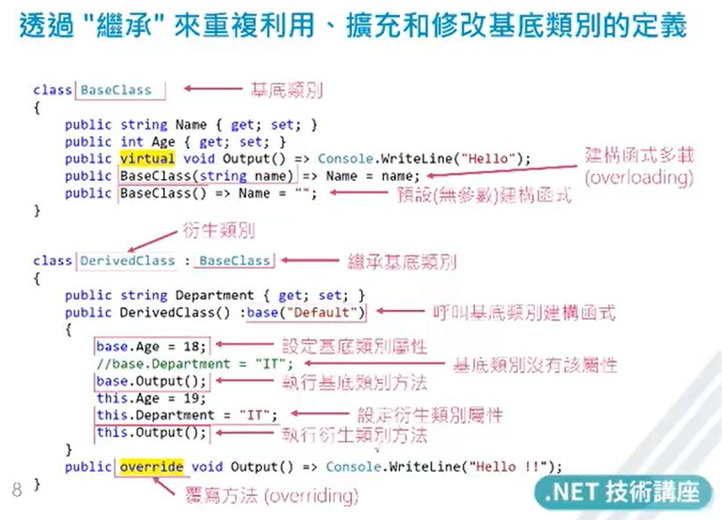
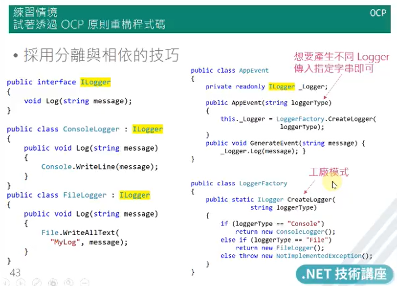
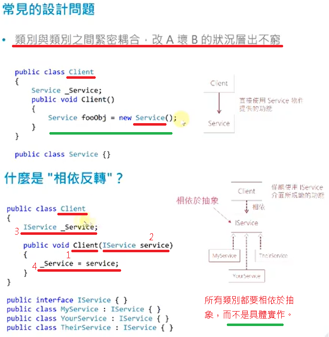
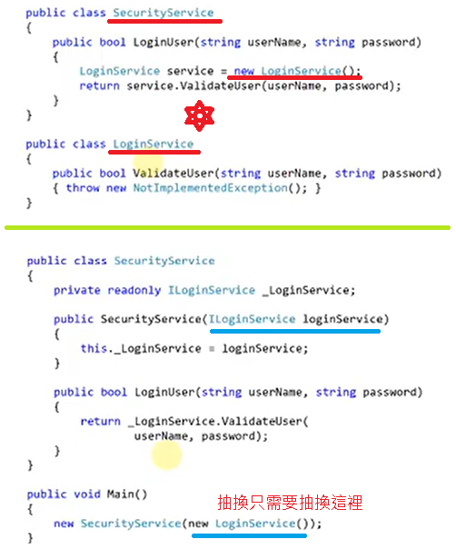

# 2020_0615 - 2020_0616

## 為何需要 SOLID

維護 ↑ / 多人協作 ↑ / 可讀 ↑ / 擴充 ↑ / 耦合 ↓ / 內聚 ↑

原則 : 知好、評好

SOLID 取決於你多了解需求。不然請遵守 DRY、KISS、YAGNI

Don’t Repeat Yourself

Keep It Simple & Stupid

You Ain’t Gonna Need It

### OOP

抽象->類別 / 封裝 public private / 繼承 / 多型( virtual 定義可被 overide，衍生類別才去做 )、overlanding 也是其中一種 (sealed 定義不可被繼承)

### Module

是一種抽象概念

* 可以是 class
* 可以是 method
* 可以是 assembly 組件

目的是 內聚 ↑ / 耦合 ↓

### SOLID

#### SRP

> 一個類只有一種責任。

* 目的：

提高內聚力。

* 使用時機：

1. 類別、維護、BUG、調用開始複雜
2. 重複利用、未來擴充需求

* 工具

相依類別圖

#### OCP

> 開放封閉：給擴充(繼承或擴充方法)但不准對原始碼修改

##### C# 擴充方法

> 寫 class 時 public static string Reverse(this string s)
>
> StringExtension.Reverse(s);
>
> ->
>
> s.Reverse();
>
> <https://www.huanlintalk.com/2009/01/csharp-3-extension-methods.html>

但如果不是用最強 IDE 時不可亂用避免擴充到重複名稱的基類

抽象類別基類 變數名稱 = new 衍生類別

* 使用時機：

類已清楚定義，且穩定。改為 OCP

> 介面與抽象類別差別：介面不能寫 Code 在裡面，相較於抽象類別偶和度低。

#### LSP

> 里氏替換：子型別必須可替換為父型別，型別轉後無BUG -> 實作繼承&多型 (virtual overide)

* 如何避免里氏/繼承錯誤？

把警告！看完

* 抽象類別、類別、介面哪個適合實現 LSP ?

介面耦合性相對比較低一點

#### ISP

> 多個用戶端專用的介面優於一個通用需求介面，用戶端不應該強迫相依於沒用到的介面

* 操作方式

使用介面分割超大類別

不同需求的屬性與方法放在不同介面中

interface 不應該包山包海

特定需求沒用到的方法，不要加入到介面中，另外建一個

interface 可以當作屬性與方法的群組

* 目的

使系統 鬆散耦合、安全重構、功能擴充

* 使用時機

API 都定義在超大介面中

用戶端相依一堆用不到的介面方法

Rename symbol f2

<https://code.visualstudio.com/docs/editor/refactoring>

#### DIP

> 相依反轉
> 高階模組不應該依賴低階模組，兩者都要依賴於抽象

* 高階模組：Caller (呼叫端)
* 低階模組：Callee (被呼叫端)

> 抽象不應該相依於細節，而是細節應該相依於抽象

* 精神

所有類別都要相依於抽象，而不是具體實作。可透過 DI Container 達到，

* 目的

達到類別間鬆散耦合，開發過程中，所有類別之間偶合關係一律透過抽象介面，可以依據需求隨時抽換具體實作類別。

SOLID 在最後 DI 這就都串起來了，

DIP 讓整體都相依於 interface 這時再套用 ISP 將介面切至最小，

這時相對的就比較好實作符合 LSP、OCP、SRP 規則的類別。

* 使用時機

降低耦合 (大型系統)

團隊有效率開發 (介面就像藍圖、類別就像真實施工)

系統彈性符合 DIP 通常也會符合 OPC、LSP 只要再多考量 SRP、ISP 即可

想導入 TDD 測試驅動開發 或 單元測試 時

穩定的 CODE 需要改 DIP 嗎？ 否

通常在建構式實作依賴反轉

---

總結

爛CODE一次性 -> SOLID重構 -> 測試驅動/單元測試 -> 套裝軟體
