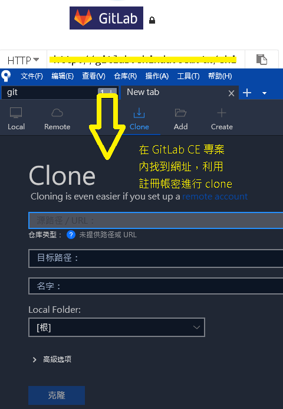
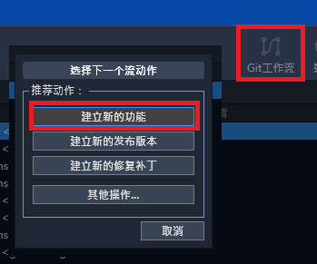
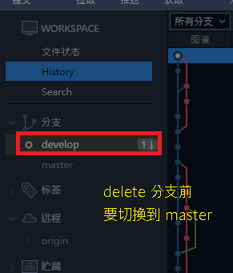
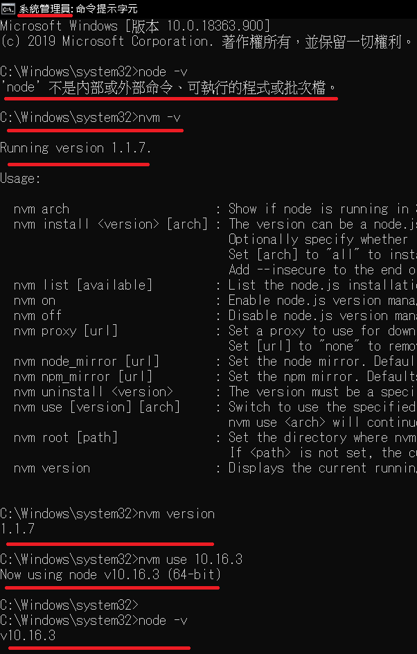

# 2020_0615

開華泰銀行、熟悉辦公環境

DBRever -> Oracle

node.js

1. nvm for windows
2. ctrl+p > nvm version 確認 nvm 是否有安裝成功
3. nvm ls 目前 local 所有 Node.js 版本
4. nvm ls-remote 列出所有 Remote 的 Node.js 版本 (不知道為何沒作用，可能因為 nvm 是新版的有改了什麼)
5. nvm install latest 14.4.0
6. nvm alias default [version] 指令以後預設啟用的 Node.js 版本
7. nvm use [version] 使用 [version] 版本，但不更改預設啟用的版本

原本想嘗試 yarn 但怕有些 package 會不支援就先緩緩。

Gmail x3123456 * 2 fstX uppercase allen.liu@shinda.com.tw AD 192.168.0.131 47 165

以前沒試過彈性工時，感覺真的蠻彈性的，就不會有遲到或太趕的問題，9 - 6、8 - 10

申請流程 請假單

Gitlab Uname liu091 psd X3123

email allen.lin psd x3123456

winbase no ssl

gitflow feature -> develop

接手專案 Router 較複雜 內部 framework nuget DI 環境 fake 開發用資料存取

期望 Dropbox -> 程式 -> localDB

一些命名通則就參考這個

<https://docs.microsoft.com/zh-tw/dotnet/standard/design-guidelines/naming-guidelines>

SourceTree

pageantkey list

LinQpad

## 參考

<https://gitbook.tw/chapters/gitflow/why-need-git-flow.html>

<https://ithelp.ithome.com.tw/articles/10184980>

<https://blog.goodjack.tw/2018/03/visual-studio-code-extensions.html#markdown-%E7%9B%B8%E9%97%9C>

---

## 後續補充 前端框架環境建置

首先是安裝別種版本的 node 但中間遇到了類似 `'npm' 不是內部或外部命令、可執行的程式或批次檔`

指令無法成功使用的問題

之後是利用系統開 cmd 下指令才解決

<https://ithelp.ithome.com.tw/articles/10212118>

cmd - npm i 就會依照 package-lock 進行套件安裝

中間沒出事就可以開啟專案了

再來是 vscode 小技巧 左下角有 script 的 gui 可以直接免打指令啟動

後端要起專案要先將 WANHOM 包起來的 Nuget 載入

)

## 0629

SAM / PAM 後端要開起來 前端 Portal 才會有資料

嘗試用 IIS 開3個 API 避免電腦過燙 <http://silanors.blogspot.com/2011/04/iisiis7.html>
