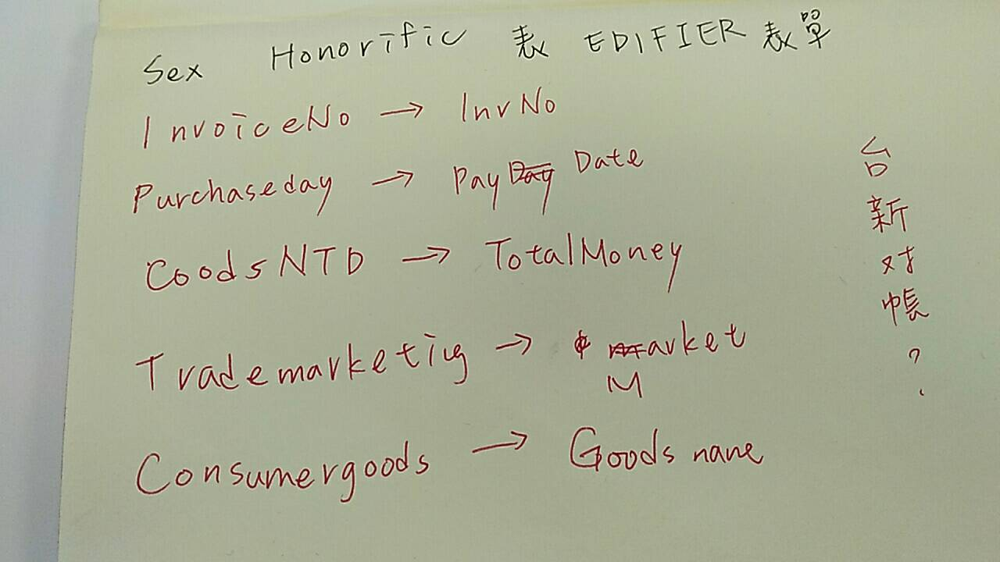

# 20190826

解決 office . dll 存取權限不足問題

搞半天只要把 iis進階設定換個有權限的使用者就好

優化抽獎頁 db 與 ui ux

history.go\(-1\)

後台easyui 修改完成 用於顯示 抽獎頁內容 \( 功能有顯示與匯出excel清單

```text
SELECT id,[Name],CASE Lottery.Sex WHEN 1 THEN '男' WHEN 0 THEN '女' END as Sex,DayPhone,MobilePhone,RTRIM(DeliverCity)+RTRIM(DeliverState)+DeliverAddr as address,InvNO,convert(varchar, PayDate, 102) as PayDate,Convert(varchar(10),DataTime,111) as DataTime,Market,Goodsname,memo,'' as cno 
FROM Lottery
where PayDate >= DATEADD(day,DATEDIFF(day,'','2019/08/01'),'')
AND PayDate <= DATEADD(day,DATEDIFF(day,'','2019/08/22')+1,'')
```


昨日街道測試通知了 應該要來加把勁看一下

整理一下 基本html5 內容

js共筆再看一次

codilisty 範例看完

應該就要考了不然來不及

9月1號前要交，我在猜現在應該是星期六上午是個最好的時機點

下班前lerk感覺有來盯一下看我怎弄那麼久，看來豪俊走了就換我要被電了 ...




