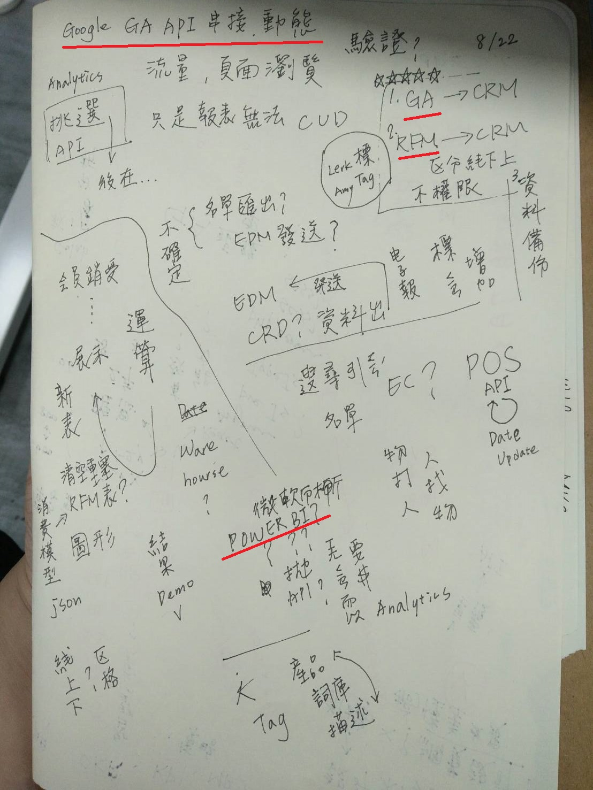

# 20190808

開始接觸 CRM 系統 ASP.NET\_MVC 開發 從無到有

套公司買的前端模板好像用很多圖表框架寫的

討論了一堆感覺很專業的東西 ... AP GA 













{% embed url="https://medium.com/backend-record/%E5%A6%82%E4%BD%95%E7%94%A8php-%E5%BE%9Egoogle-analytics-api-%E6%8A%93%E8%B3%87%E6%96%99-834a69bbec6d" %}



























{% embed url="http://www.forpower.com/blog/2013/09/16/%E5%9C%A8ms-sql-server%E4%B8%AD%E5%AF%A6%E7%8F%BEmysql-limit%E7%9A%84%E5%81%9A%E6%B3%95/" %}

