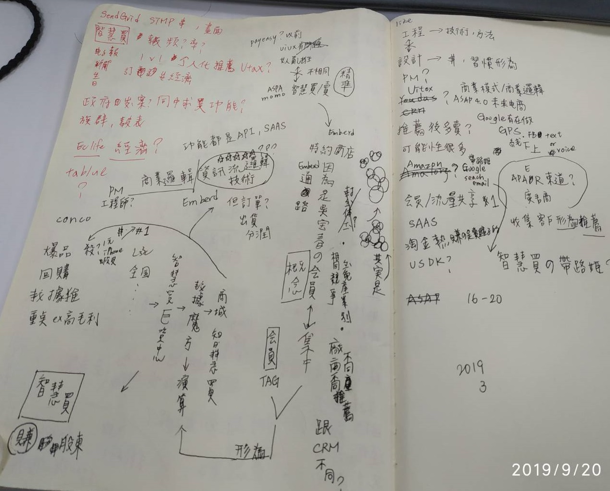

# 20190920

請找人幫我撈 EP 三年內有消費的會員資料 & 消費明細 給我  
需要 .. 日商伺服器安全機制嚴謹需要vpn過去才能連線


搞了一上午

```text
SELECT los.SerialNo AS 訂單編號, 
       los.PostDate AS 訂單日期, 
       los.MemberNo AS 會員編號, 
       M.[NAME] AS 姓名, 
       M.Birthday AS 生日, 
       los.cno AS 統編,
       CASE lom.SendMode
           WHEN '1'
           THEN '新竹貨運'
           WHEN '2'
           THEN '快遞'
           WHEN '3'
           THEN '宅即便'
           WHEN '4'
           THEN '郵局'
           WHEN '5'
           THEN '門市自取'
           WHEN '6'
           THEN '良興物流'
           WHEN '7'
           THEN '廠商指送'
           WHEN '8'
           THEN '第一宅配'
           WHEN '12'
           THEN '超商取貨'
       END AS 運送方式, 
       los.ProductNO AS 產品編號, 
       ll.CategoryName AS 大類名稱, 
       lm.CategoryName AS 中類名稱, 
       ls.SubMediumName AS 小類名稱, 
       los.amount AS 數量, 
       los.SpicalPrice AS 單價, 
       los.SubStatusMemo AS 明細欄備註, 
       M.LiveAddress AS 地址區域, 
       lom.[Status]
FROM ListOrder_Sub los
     LEFT JOIN member M ON M.cno = los.MemberNo
     LEFT JOIN ListOrder_Main lom ON los.SerialNo = lom.SerialNo
     LEFT JOIN listlargetype ll ON los.Largeno = ll.SerialNo
     LEFT JOIN listmediumtype lm ON los.Mediumno = lm.SerialNo
     LEFT JOIN listmediumSubtype ls ON los.SubMediumno = ls.SubMediumID
WHERE los.SerialNo IN
(
    --3年內已出貨訂單的 memberno
    SELECT lom.SerialNo
    FROM dbo.ListOrder_Main lom
    WHERE lom.PostDate BETWEEN '2016-01-01' AND '2019-08-31'
          AND lom.[Status] IN(1, 2, 3)
)
     AND los.ProductNO NOT LIKE 'Z%'
ORDER BY M.cno, 
         los.serialno;
```


11:50 ㄩ\ㄔㄥ/ 想請問你早餐會討論的，原本是參考叡揚現在變成參考谷歌跟亞馬遜是正常的嗎，還是CRM跟智慧賣賣是不同東西? 感覺討論商業邏輯是ok，但資訊流/技術，程式部門編制根本比不了吧... 11:52 晴柏 恩 對阿 他們想要把系統做得更好 11:52 晴柏 不過感覺還在規劃中 11:52 晴柏 聽聽 就好 哈 11:53 ㄩ\ㄔㄥ/ 可是已經參考到亞馬遜跟谷歌了...可能光工程師人數就跟整間EC一樣多人了... 11:53 晴柏 我前前公司 是做通訊行 POS的 11:53 晴柏 老闆老是在念 要改版 POS強化版2.0 11:53 晴柏 原本是1.0 11:54 晴柏 直到 我離職後 也還沒開始改 11:55 晴柏 對阿 人數規模根本不能比 11:55 晴柏 卻要做出一樣的東西 = = 11:56 晴柏 這樣 我寧願去谷哥上班 哈 11:57 ㄩ\ㄔㄥ/ 可是應該沒有類似像拿雞腿比青菜吧 ... 像 Sendgird 串 api 因為應用跟一般公司應用不一樣\(大部分都azure但我們要本地端\)就快搞一整天... 12:01 晴柏 恩 12:02 晴柏 我到現在 還是抓不到 apiKey



[https://trello.com/b/8g4xMMuq/jason-2019%E9%90%B5%E4%BA%BA%E8%B3%BD-it%E9%82%A6%E5%B9%AB%E5%BF%99](https://trello.com/b/8g4xMMuq/jason-2019%E9%90%B5%E4%BA%BA%E8%B3%BD-it%E9%82%A6%E5%B9%AB%E5%BF%99)

```text
APP_Push推播

建檔日期: 2019/09/20

[Method] POST

[API編號] API41

[正式URL]
    https://app.eclife.com.tw/v1/APP_Push/index.aspx


[header欄位]
欄名    格式    必填    請代入此key    說明
appkey    String    v    請良興窗口    認證key

[header欄位]
欄名    格式    必填    請代入此key    說明
token    String    v    由良興系統支援部提供    APP_Push_token
[要求欄位]
欄名    格式    必填    預設    說明
memberNo    string    v        接收推播的會員編號
title    string    v        Push_title
message    string    v        Push_message

[回應欄位]
欄名    格式    說明

[Sample - Success]
?
1
2
3
4
5
6
{
    "status": "ok",
    "message": "已成功推播",
    "sessionId": "ASP.NET_SessionId=nujmkxz5jxkt13btav2hsgqm",
    "data": null
}

[Sample - failure]
?
1
2
3
4
5
6
{
    "status": "error",
    "message": "錯誤訊息",
    "sessionId": "ASP.NET_SessionId=nujmkxz5jxkt13btav2hsgqm",
    "data": null
}


良興APP API v1 說明文件
請先讀我
申請、權利與義務
編碼
回應格式
JSON
使用說明
資料傳遞
APP頁面轉跳參數定義
異動記錄
異動清單
v1
home (API2,API6)
about (API2-1)
terms (API2-2)
login (API10)
fbUserIdCheck (API10-1)
logout (API13)
register (API12)
forgotpassword (API11)
userinfo (API14)
product (API6)
product (API6-1推薦)
product (API6-3庫存)
productService (API6)
productService2 (API6)
productlist (API5)
productlist (API5-1金賺)
productlist (API5-2紅利)
productlist (API5-3追蹤)
productlist (API5-4條碼搜尋)
productlist (API5-5搜尋)
productCategory (API1-2)
productCategoryR (API1-2)
tracelist (API3)
traceAddOrRemove (API3-1)
searchKeywords (API4)
put2cart (API30-1)
removeCartItem (API30-2)
removeCartItemAll (API30-5)
cartlist (API30)
cartlistCount (API39-5)
24hProc (API30-3)
citystate (API30-4)
checkout (API34)
cartBuyMore_Put2Cart (API35)
購物金折抵
discount_shoppingcash (API32-1)
紅利折抵
discount_bonus (API32-2)
序號折抵
discount_coupon (API32-3)
orderlist (API20)
contactUs (API8)
contactCategory (API8-1)
storelist (API1-1)
storelistForService (API1-3)
storeServiceCategory (API1-2)
storeService (API6-4)
shoppingcashlist (API21)
messagelist (API22)
edmlist (EDM) (API23)
pushRegister (API33-1)
pushUnRegister (API33-2)
更新會員資料
Update_MemData (API36)
最新版本編號
version (API37)
(2018-09-25新增)
服務員清單
attendantlist (API38-1)
綁定服務員
Choose_attendant (API38-2)
取消服務員榜定原因清單
Cancel_attendant_reason_list (API38-3)
取消服務員榜定
Cancel_attendant (API38-4)
呼叫服務員-專人服務 服務內容清單
attendant_service_list (API38-5)
呼叫服務員-專人服務
Call_attendant (API38-6)
關於服務員綁定
about_attendant (API38-7)
新版MegaMenu分類
MegaMenuCategory (API39)
新版MegaMenu館別
MegaMenu (API39-1)
APP_Push (API41)
手機發送驗證簡訊
Mobile_Verify_SMS (API42
```

