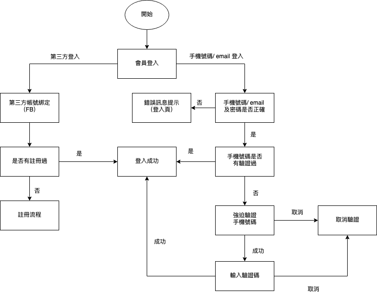

# 20190926

繼續修正epson nav 包含前後台

卡在商品類別需要銷售部門調整

換成弄 epson 靜態網頁需求單



aso

```text
目錄結構
靜態目錄
├─ wwwroot
│ ├─ bundle //壓縮後的共用檔案(.html, .js, .css) - 由根目錄 bundleconfig.json 設定
│ ├─ lib //JS套件 或 擴充的JS 或 其它共用檔案
│ │ ├─ utils //web+mobile共用js ex. 擴充的相關方法 跳窗,facebook,gogole…
│ │ ├─ vue //vue實例 (web與mobile應該參考相同的實例因為只有ui不同資料來源相同 - 對應 web/views and models/views)
│ │ ├─ … //其他有使用到的套件
│ │
│ ├─ mobile //mobile版會用到的檔案
│ │ ├─ components //組件 (mobile)
│ │ ├─ css
│ │ ├─ fonts
│ │ ├─ images
│ │ ├─ sass
│ │ ├─ views //mobile版vue模板
│ │
│ ├─ web //web版會用到的檔案
│ │ ├─ components //組件 (web+mobile共用)
│ │ ├─ css
│ │ ├─ fonts
│ │ ├─ images
│ │ ├─ sass
│ │ ├─ views //web版vue模板
│ │
│ ├─ favicon.ico
│ ├─ sitemap //分館的sitemap
│ ├─ robots.txt //排除網站 http
│ ├─ robots_ssl.txt //排除網站 https
│ ├─ sitemap.xml //網站sitemap

MVC
├─ Controllers //URL進入點 執行邏輯 渲染到 Views
├─ ECAPI //中介程式 (WEB2API)
├─ Models //數據轉換需要的 Class - 這邊只放for前端的models, 與api共用的要放到models.dll
├─ Services //商業邏輯
├─ Views //顯示邏輯
├─ apiroute.json //ApiUrl設定
├─ ApiRouteModel.cs //ApiUrl設定的物件
├─ appsettings.json //網站基本設定
├─ AppSettingsModel.cs //網站基本設定的物件
├─ bundleconfig.json //壓縮Css, Js
├─ Program.cs //程式進入點
├─ Route.cs //路由設定
├─ Startup.cs //啟動網站設定

Models
├─ ECAPI //存放 API+MVC 使用的共用 Class
```

