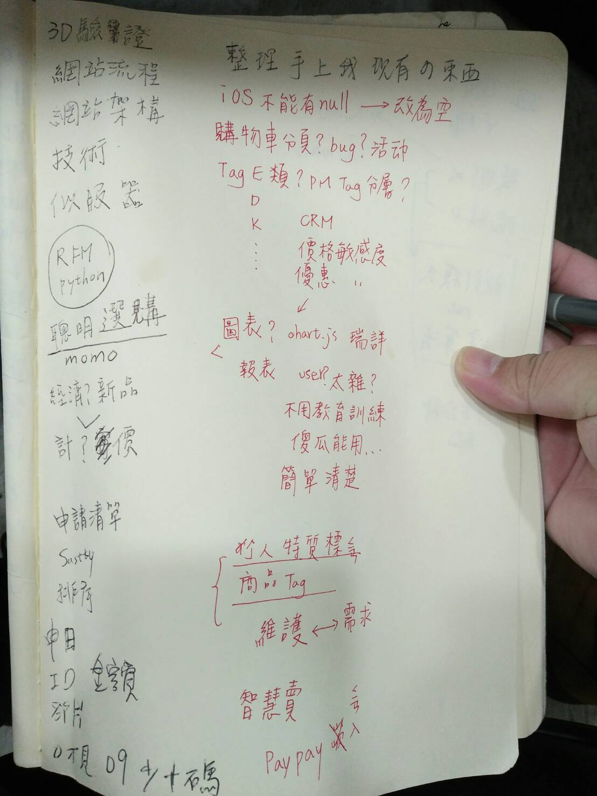
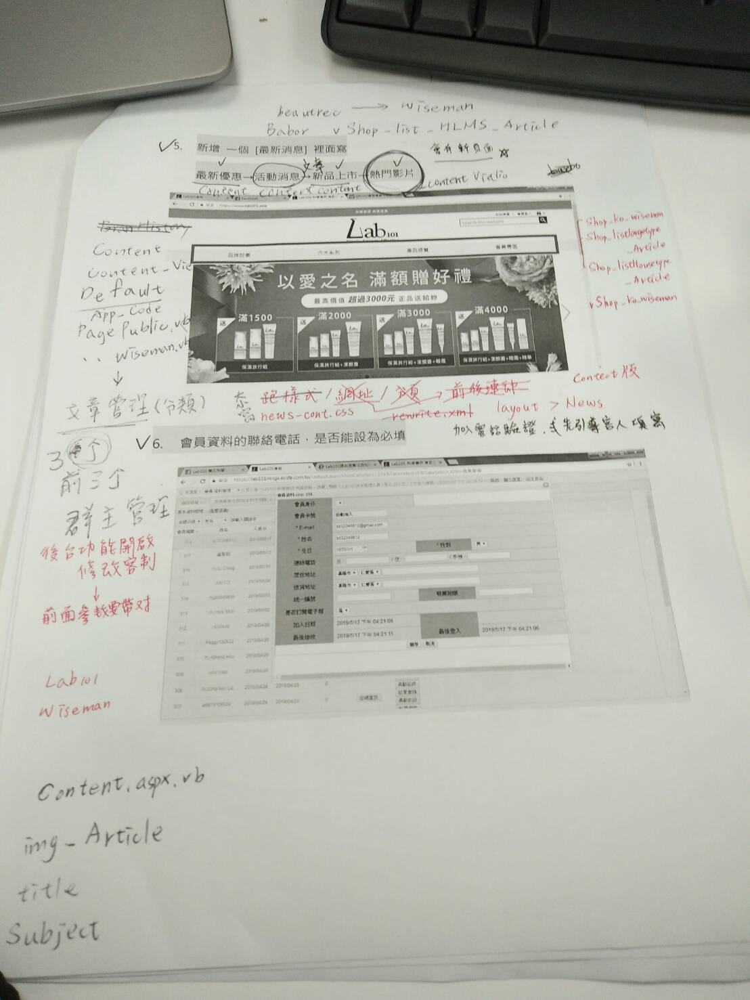

# 20190905



繼續lab101前後台需求單

前後台黏合性很高

前後台都是改其他模板內容來改的但版本不一樣，問題點蠻多的

需要熟悉架構的人來改才會快，

但如果是從零開發，對我來說的時間或許需要更多

所以問題都是相對的，

運用到的技術有

easyui 與 ckeditor 與 URL Rewrite xml 正則表達式

webform頁面

用使用者控制項與easyui的模板進行多頁面的串接

形成後台的大結構與強黏合性

然後還有許多函式庫與TSQL庫的叫用

套版上現在遇到問題較難解

似乎是重結構與屬性造成樣式吃不到 留待明日解











