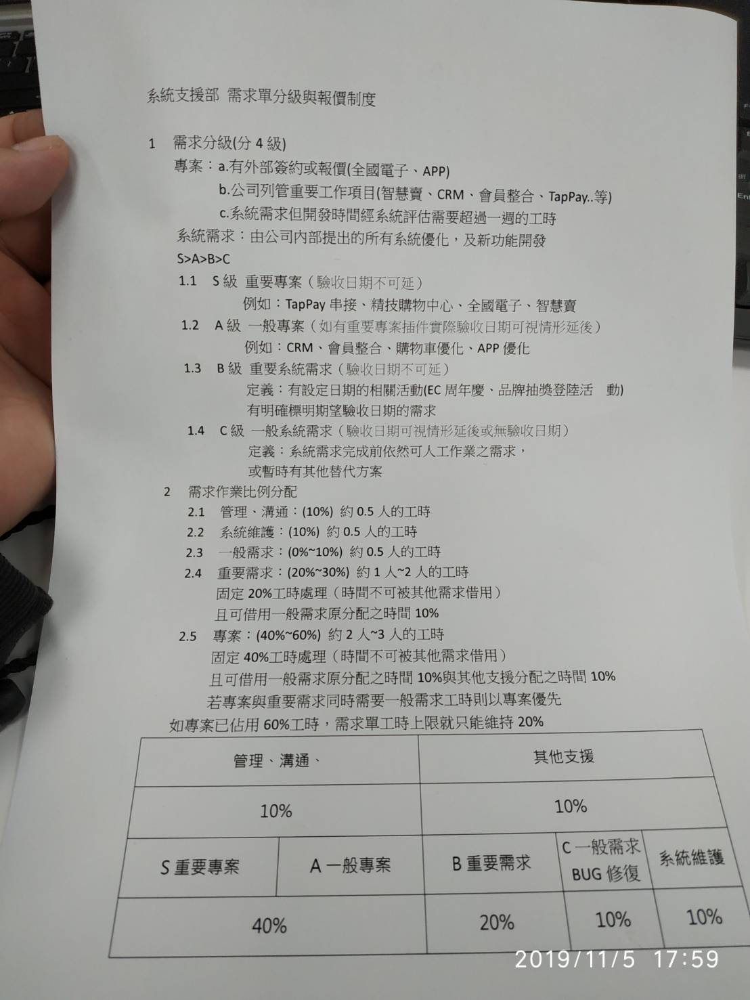

# 20191105

精技 AP YAHOO SHOPPING SCM API

EC後台全館購物金BUG




```text
201910月份工作項目-育誠
1.Aimedia / Sastty 春聯bug修正
2.epson menu 前後台需求
3.ec後台全國報表修改
4.crm iis 架設 db 建置 token 設定
5.msi megamenu 需求
6.lab101 video 頁面修正
7.epson 登入送購物金需求
8.crm 排程預存整理
9.epson recycle 網站需求
10.crm 資料庫備份
11.全國電子AP API倒回狀態需求
12.Sastty抽獎修正
13.耗材回購欄位crud需求
14.KPI報表欄位修正
15.全國電子後台會員權限需求
16.購物車未結帳報表
17.EC後台服務員綁定報表
```


```text
AdBlock
3.60.0
最受歡迎的 Chrome 擴充功能，擁有超過六千萬使用者！阻擋網路上的各種廣告。
ID：gighmmpiobklfepjocnamgkkbiglidom
查看檢視模式
背景頁面
擴充功能圖示
Bootstrap Grid Overlay
0.1.1
Quickly toggle a Bootstrap Grid Overlay that automatically uses your application's styles to determine how it looks.
ID：mnlklmelflkheijccafopdohgclfefcg
查看檢視模式
背景頁面
擴充功能圖示
ColorPick Eyedropper
0.0.2.30
An eye-dropper & color-picker tool that allows you to select color values from webpages.
ID：ohcpnigalekghcmgcdcenkpelffpdolg
查看檢視模式
背景頁面 (無法使用)
擴充功能圖示
Cookie AutoDelete
3.0.2
Control your cookies! Auto-delete unused cookies from your closed tabs while keeping the ones you want.
ID：fhcgjolkccmbidfldomjliifgaodjagh
查看檢視模式
背景頁面
擴充功能圖示
Dark Reader
4.8.4
黑色主題，適用於任何網站。關愛眼睛，使用Dark Reader進行夜間和日間瀏覽。
ID：eimadpbcbfnmbkopoojfekhnkhdbieeh
查看檢視模式
background/index.html
擴充功能圖示
Google 文件離線版
1.7
使用 Google 文件系列產品離線處理文件。
ID：ghbmnnjooekpmoecnnnilnnbdlolhkhi
查看檢視模式
背景頁面 (無法使用)
擴充功能圖示
Google 翻譯
2.0.7
瀏覽網頁時可輕鬆查閱翻譯版本。Google 翻譯小組提供。
ID：aapbdbdomjkkjkaonfhkkikfgjllcleb
查看檢視模式
背景頁面 (無法使用)
擴充功能圖示
HTML5 Outliner
0.8.13
Generates a navigable page outline with heading and sectioning elements
ID：afoibpobokebhgfnknfndkgemglggomo
查看檢視模式
背景頁面
擴充功能圖示
OneTab
1.18
節省高達95％的記憶體，並減輕分頁混亂現象
ID：chphlpgkkbolifaimnlloiipkdnihall
查看檢視模式
onetab.html,
還有 1 個畫面…
擴充功能圖示
Page Ruler
1.0.4
Draw a ruler to get pixel dimensions and positioning, and measure elements on any web page.
ID：emliamioobfffbgcfdchabfibonehkme
查看檢視模式
背景頁面
擴充功能圖示
Wappalyzer
5.8.5
Identify web technologies
ID：gppongmhjkpfnbhagpmjfkannfbllamg
查看檢視模式
html/background.html
擴充功能圖示
Window Resizer Beta
2.1.1 Beta
This is the BETA version of the Window Resizer extension, available only pre-launch.
ID：pnhnbekjlbamfnnemcaolkjchjlidbib
查看檢視模式
背景頁面
擴充功能圖示
捕捉網頁截圖 - FireShot的
0.98.97.1
捕捉網頁截圖，然後編輯，並將它們保存到PDF，JPEG，GIF，PNG或BMP，上傳，打印，在Photoshop中打開，複製到剪貼板或電子郵件
ID：mcbpblocgmgfnpjjppndjkmgjaogfceg
查看檢視模式
背景頁面
擴充功能圖示
超級簡單的自動刷新
1.0.3
最簡單的自動刷新網頁工具，解放您的F5按鈕，只需單擊一次就開始刷新，您也可以自定義刷新時間
ID：gljclgacfalmnebgmhknodlplmngmfpi
查看檢視模式
background.html
Chrome 應用程式
應用程式圖示
Cherry Tomato
3.2.21
A tool to boost your productivty
ID：cghomilbbfdmgfidkdinillpmdpdjgmm
查看檢視模式
背景頁面 (無法使用)
應用程式圖示
Postman
5.5.4
ID：fhbjgbiflinjbdggehcddcbncdddomop
查看檢視模式
背景頁面 (無法使用)
應用程式圖示
文件
0.10
建立及編輯文件
ID：aohghmighlieiainnegkcijnfilokake
應用程式圖示
簡報
0.10
建立及編輯簡報
ID：aapocclcgogkmnckokdopfmhonfmgoek
應用程式圖示
試算表
1.2
建立及編輯試算表
ID：felcaaldnbdncclmgdcncolpebgiejap
```

