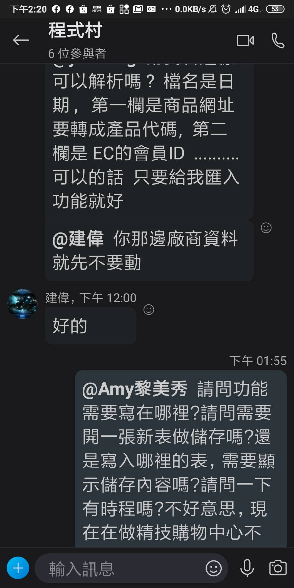
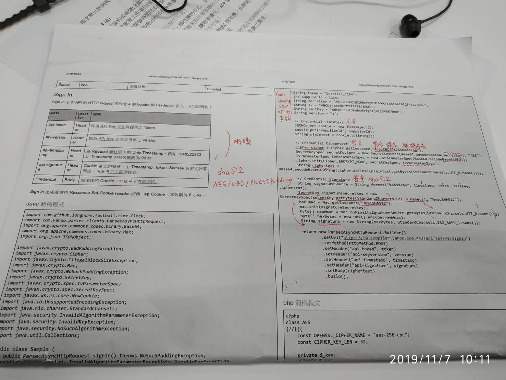

# 20191107

精技ap header 加密

tableau 窗口溝通



????





sha512 [密碼雜湊函式](https://zh.wikipedia.org/wiki/%E5%AF%86%E7%A2%BC%E9%9B%9C%E6%B9%8A%E5%87%BD%E6%95%B8)演算法標準



AES 算法 CBC 模式 PKCS5Padding 補碼方式









