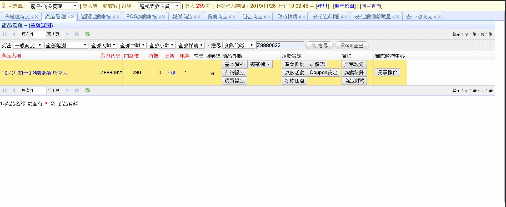

# 20191126

精技 連動 insert 已 ok 接著處理 儲存後端程式碼

涉及如何動態存取 response 連動 insert

先處理 結構化屬性設定 修改資料部分


回頭處理bug 沒有屬性的小類直接不顯示 或是提示字 ? 

修正完成 如產品已有資料進入修改頁面自動帶入之前資料








感覺只能在動態取dom大小帶進後台利用 request 取值了




```text
<%@ WebHandler Language="VB" Class="ajax_Get_category" %>

Imports System
Imports System.Web
Imports System.Web.UI

Public Class ajax_Get_category : Implements IHttpHandler
    Public attrclass As String = HttpContext.Current.Request("attrclass")
    Public catItemId As String = HttpContext.Current.Request("catItemId")
    Public level1 As String = HttpContext.Current.Request("level1")
    Public level2 As String = HttpContext.Current.Request("level2")


    Public Sub ProcessRequest(ByVal context As HttpContext) Implements IHttpHandler.ProcessRequest

        '小類觸發屬性 AJAX
        If catItemId <> "" Or catItemId <> Nothing Then

            Select Case attrclass
                Case "level1"
                    '查屬性
                    Dim attrbrandsql = "SELECT * FROM YahooshoppingSCM_API_struDataAttrClusters WITH (NOLOCK) WHERE catItemId='{0}' AND Attrrequired = 'True'"
                    attrbrandsql = String.Format(attrbrandsql, catItemId)
                    Dim dt = EC.DB.ExecuteDataTable(attrbrandsql)

                    '轉為選項
                    Dim htmltext = "<option value='未選擇'>未選擇</option>"

                    For num As Integer = 0 To dt.Rows.Count - 1 Step 1
                        htmltext += "<option value='" + dt.Rows.Item(num).Item("Attrname") + "'>" + dt.Rows.Item(num).Item("Attrname") + "</option>"
                    Next

                    context.Response.ContentType = "text/plain"
                    context.Response.Write(htmltext)

                Case "level2"
                    '查屬性
                    Dim attrbrandsql = "SELECT * FROM YahooshoppingSCM_API_struDataAttrClusters WITH (NOLOCK) WHERE catItemId='{0}' AND Attrrequired = 'True' AND Attrname <> '{1}'"
                    attrbrandsql = String.Format(attrbrandsql, catItemId, level1)
                    Dim dt = EC.DB.ExecuteDataTable(attrbrandsql)

                    '轉為選項
                    Dim htmltext = "<option value='未選擇'>未選擇</option>"
                    For num As Integer = 0 To dt.Rows.Count - 1 Step 1
                        htmltext += "<option value='" + dt.Rows.Item(num).Item("Attrname") + "'>" + dt.Rows.Item(num).Item("Attrname") + "</option>"
                    Next

                    context.Response.ContentType = "text/plain"
                    context.Response.Write(htmltext)


                Case "required"

                    '查必填屬性
                    '必填非自定義屬性
                    Dim attrbrandsql = "SELECT * FROM YahooshoppingSCM_API_struDataAttrClusters WITH (NOLOCK) WHERE catItemId='{0}' AND Attrrequired = 'True' AND Attrtype <> 'text'"
                    attrbrandsql = String.Format(attrbrandsql, catItemId)
                    Dim dt = EC.DB.ExecuteDataTable(attrbrandsql)

                    Dim attrrequireds
                    For num1 As Integer = 0 To dt.Rows.Count - 1 Step 1

                        Dim dtstring = dt.Rows.Item(num1).Item("Attrname").ToString
                        attrrequireds += "<input value='{0}' readonly='ReadOnly'/>:<select id='attrnoncustom{1}' name='attrnoncustom{2}'><option value='未選擇'>未選擇</option>"

                        attrrequireds = String.Format(attrrequireds, dtstring, num1, num1)

                        '轉為目標格式
                        Dim attrs = dt.Rows.Item(num1).Item("Attrvalues").ToString
                        Dim clear() As Char = {"[", "]"}
                        attrs = attrs.Trim(clear)
                        attrs = attrs.Replace("""", Nothing)
                        Dim requireds() = attrs.Split(",")

                        '轉為選擇與選項
                        For num2 As Integer = 0 To requireds.Count - 1 Step 1
                            attrrequireds += "<option value='" + requireds(num2) + "'>" + requireds(num2) + "</option>"
                        Next
                        attrrequireds += "</select></br>"
                    Next
                    '必填自定義屬性

                    Dim attrbrandsql2 = "SELECT * FROM YahooshoppingSCM_API_struDataAttrClusters WITH (NOLOCK) WHERE catItemId='{0}' AND Attrrequired = 'True' AND Attrtype = 'text'"
                    attrbrandsql2 = String.Format(attrbrandsql2, catItemId)
                    Dim dt2 = EC.DB.ExecuteDataTable(attrbrandsql2)

                    attrrequireds += "</br></br>"

                    For num1 As Integer = 0 To dt2.Rows.Count - 1 Step 1

                        Dim dtstring = dt2.Rows.Item(num1).Item("Attrname").ToString
                        attrrequireds += "<input value='{0}' readonly='ReadOnly'/>:<input id='attrcustom{1}' name='attrcustom{2}'>"

                        attrrequireds = String.Format(attrrequireds, dtstring, num1, num1)

                        attrrequireds += "</br>"
                    Next

                    context.Response.ContentType = "text/plain"
                    context.Response.Write(attrrequireds)

            End Select

        End If

    End Sub

    Public ReadOnly Property IsReusable() As Boolean Implements IHttpHandler.IsReusable
        Get
            Return False
        End Get
    End Property

End Class
```

```text
<%@ WebHandler Language="VB" Class="ajax_Get_category" %>

Imports System
Imports System.Web
Imports System.Web.UI

Public Class ajax_Get_category : Implements IHttpHandler
    Public subStationId As String = HttpContext.Current.Request("subStationId")
    Public categoryId As String = HttpContext.Current.Request("categoryId")

    Public yahooCategorycats As String
    Public yahooCategorycatitems As String

    Public Sub ProcessRequest(ByVal context As HttpContext) Implements IHttpHandler.ProcessRequest

        '大類觸發中類 AJAX
        If subStationId <> "" Or subStationId <> Nothing Then

            '用於結構化雅虎商品類別 

            Dim APICategorydtSql = String.Format("SELECT categoryId,categoryIdname FROM YahooshoppingSCM_API_Category WITH(NOLOCK) WHERE subId='{0}' GROUP BY categoryId,categoryIdname", subStationId)
            Dim APICategorydt = EC.DB.ExecuteDataTable(APICategorydtSql)

            yahooCategorycats += "<option value='未選擇'>未選擇</option>"

            For num As Integer = 0 To APICategorydt.Rows.Count - 1 Step 1
                yahooCategorycats += "<option value='" + APICategorydt.Rows.Item(num).Item(0) + "'>" + APICategorydt.Rows.Item(num).Item(1) + "</option>"
            Next

            context.Response.ContentType = "text/plain"
            context.Response.Write(yahooCategorycats)

        End If

        '中類觸發小類 AJAX
        If categoryId <> "" Or categoryId <> Nothing Then

            '用於結構化雅虎商品類別 

            yahooCategorycatitems += "<option value='未選擇'>未選擇</option>"

            Dim APICategorydtSql = String.Format("SELECT catItemId,catItemIdname FROM YahooshoppingSCM_API_Category WITH(NOLOCK) WHERE categoryId='{0}' GROUP BY catItemId,catItemIdname", categoryId)
            Dim APICategorydt = EC.DB.ExecuteDataTable(APICategorydtSql)

            For num As Integer = 0 To APICategorydt.Rows.Count - 1 Step 1
                yahooCategorycatitems += "<option value='" + APICategorydt.Rows.Item(num).Item(0) + "'>" + APICategorydt.Rows.Item(num).Item(1) + "</option>"
            Next

            context.Response.ContentType = "text/plain"
            context.Response.Write(yahooCategorycatitems)

        End If

    End Sub

    Public ReadOnly Property IsReusable() As Boolean Implements IHttpHandler.IsReusable
        Get
            Return False
        End Get
    End Property

End Class
```

```text
<%@ Page Language="VB" AutoEventWireup="false" MasterPageFile="~/MasterPage.master" CodeFile="Form_CRUD.aspx.vb" Inherits="mng_product_list_Form" %>

<asp:Content ID="Content1" ContentPlaceHolderID="head" runat="Server">
    <script src="/lib/ckeditor_3.6.2/ckeditor.js" type="text/javascript"></script>
    <script src="/lib/ckeditor_3.6.2/config.js" type="text/javascript"></script>
</asp:Content>
<asp:Content ID="Content2" ContentPlaceHolderID="ContentPlaceHolder1" runat="Server">

    <form id="ff" action="Form_CRUD_Save.aspx?PrgID=<%=PrgID%>" enctype="multipart/form-data" method="post" style2="padding: 10px 20px 10px 40px;">
        <input type="hidden" name="id" id="id" value="<%=_ID%>" />
        <input type="hidden" name="cno" id="cno" value="<%=_ID%>" />
        <input type="hidden" name="action" id="action" value="" />
        <input type="hidden" name="cost" id="cost" value="<%=tb.cost%>" />
        <input type="hidden" name="online" id="online" value="<%=tb.OnLine%>" />
        <input type="hidden" name="spicalprice" id="spicalprice" value="<%=tb.spicalprice%>" />
        <input type="hidden" name="saleprice" id="saleprice" value="<%=tb.saleprice%>" />
        <input type="hidden" name="BonusPoint" id="BonusPoint" value="<%=tb.BonusPoint%>" />
        <input type="hidden" name="list_max_buy" id="list_max_buy" value="<%=tb.List_max_buy%>" />
        <input type="hidden" name="list_max_buy_tot" id="list_max_buy_tot" value="<%=tb.list_max_buy_tot%>" />

        <%-- 新欄位 --%>
        <input type="hidden" name="ProductNo" id="ProductNo" value="<%=ProductNo%>" />


        <table border="1" width="100%" class="doc-table">
            <%If _ID > 0 Then%>
            <tr>
                <td colspan="2" style="background-color: #faf5dd" align="right">
                    <a href="<%=tb.Moreinfo_Page_URL%>" target="_blank">開啟前台產品頁面</a>
                </td>
            </tr>
            <%End If%>
            <tr>
                <td colspan="2" style="background-color: #faf5dd">
                    <div class="cus_accordion" id="div_prod">
                        <div class="expanded" style="float: left"></div>
                        既有EC欄位 
                <div class="expanded" style="float: right"></div>
                    </div>
                </td>
            </tr>
            <tr class="div_prod">
                <td colspan="2">
                    <table border="0" width="100%">
                        <tr>
                            <td class="bg" width="80">購物中心售價:</td>
                            <td>
                                <input readonly="readonly" type="text" id="price" name="price" value="<%=tb.SpicalPrice%>" size="20" maxlength="20" />
                            </td>
                            <td class="bg">SEO商品名稱:</td>
                            <td>
                                <input readonly="readonly" type="seoUrl" id="seoUrl" name="seoUrl" value="<%=tb.ProductName%>"  />
                            </td>
                        </tr>

                        <tr>
                            <td class="bg">成本(含稅+運費):</td>
                            <td>
                                <input readonly="readonly" type="text" id="cost" name="cost" value="<%=tb.Cost%>" size="25" maxlength="20" />
                            </td>
                            <td class="bg" width="100">廠商建議價:</td>
                            <td>
                                <input readonly="readonly" type="text" id="msrp" name="msrp" value="<%=tb.SpicalPrice%>" size="25" maxlength="50" />
                            </td>
                        </tr>
                        <tr>
                            <td class="bg">商品名稱:</td>

                            <td>
                                <input readonly="readonly" type="text" id="msrp" name="msrp" value="<%=tb.ProductName%>" size="25" maxlength="50" />
                            </td>
                    </table>
                </td>
            </tr>
            

            <tr>
                <td colspan="2" style="background-color: #faf5dd">
                    <div class="cus_accordion" id="div_prod_info">
                        <div class="expanded" style="float: left"></div>
                        雅虎購物中心新增欄位
                <div class="expanded" style="float: right"></div>
                    </div>
                </td>
            </tr>
            <tr class="div_prod_info">
                <td colspan="2">
                    <table border="0" width="100%">
                        <tr>
                            <td class="bg" width="120">申請人:</td>
                            <td>
                                <input type="text" id="applicant" name="applicant" size="20" maxlength="20" value="<%=yahoolist.Item("applicant").ToString%>" />
                            </td>
                        </tr>
                        <tr>
                            <td class="bg">內容級別:</td>
                            <td colspan="4" style="color: red;">(若為未滿18歲青少年不能購買商品，請選擇限制級)<br />
                                <select name="contentRating" id="contentRating">
                                    <%=contentRatings%>
                                </select>
                            </td>
                        </tr>
                        <tr>
                            <td class="bg">賣場顯示名稱:</td>
                            <td colspan="4">
                                <br />
                                <input type="text" id="displayName" name="displayName" size="20" maxlength="20" value="<%=yahoolist.Item("displayName").ToString%>" />
                            </td>
                        </tr>
                        <tr>
                            <td class="bg">賣場簡短說明1:</td>
                            <td colspan="4" style="color: red;">至少需填說明1<br />
                                <input type="text" id="shortDescription_1" name="shortDescription_1" size="20" maxlength="20" value="<%=yahoolist.Item("shortDescription_1").ToString%>" />
                            </td>
                        </tr>
                        <tr>
                            <td class="bg">賣場簡短說明2:</td>
                            <td colspan="4">
                                <br />
                                <input type="text" id="shortDescription_2" name="shortDescription_2" size="20" maxlength="20" value="<%=yahoolist.Item("shortDescription_2").ToString%>" />
                            </td>
                        </tr>
                        <tr>
                            <td class="bg">賣場簡短說明3:</td>
                            <td colspan="4">
                                <br />
                                <input type="text" id="shortDescription_3" name="shortDescription_3" size="20" maxlength="20" value="<%=yahoolist.Item("shortDescription_3").ToString%>" />
                            </td>
                        </tr>
                        <tr>
                            <td class="bg">賣場簡短說明4:</td>
                            <td colspan="4">
                                <br />
                                <input type="text" id="shortDescription_4" name="shortDescription_4" size="20" maxlength="20" value="<%=yahoolist.Item("shortDescription_4").ToString%>" />
                            </td>
                        </tr>
                        <tr>
                            <td class="bg">賣場簡短說明5:</td>
                            <td colspan="4">
                                <br />
                                <input type="text" id="shortDescription_5" name="shortDescription_5" size="20" maxlength="20" value="<%=yahoolist.Item("shortDescription_5").ToString%>" />
                            </td>
                        </tr>

                    </table>
                </td>
            </tr>
            <tr>
                <td colspan="2" style="background-color: #faf5dd">
                    <div class="cus_accordion" id="div_setting">
                        <div class="expanded" style="float: left"></div>
                        雅虎類別設定 : <%=yahooCategorycatstext %>
                <div class="expanded" style="float: right"></div>
                    </div>
                </td>
            </tr>
            <tr class="div_setting">
                <td colspan="2">
                    <table border="0" width="100%" class2="doc-table">
                        <tr>
                            <td class="bg" width="80">所屬分類:</td>
                            <td colspan="5" >
                                <select name="subStationId" id="subStationId" onchange="">
                                    <%=yahooCategorysubs%>
                                </select>
                                <select name="categoryId" id="categoryId">
                                    <%=yahooCategorycats%>
                                </select>
                                <select name="catItemId" id="catItemId">
                                    <%=yahooCategorycatitems%>
                                </select>
                          
                            </td>
                        </tr>

                    </table>
                </td>
            </tr>
            <tr>
                <td colspan="2" style="background-color: #faf5dd">
                    <div class="cus_accordion" id="div_attrsetting">
                        <div class="expanded" style="float: left"></div>
                        結構化屬性設定 : <font style="color:red">顯示屬性都是必填屬性，如要更改請依序由大中小類屬性更改</font>
                <div class="expanded" style="float: right"></div>
                    </div>
                </td>
            </tr>
            <tr class="div_attrsetting">
                <td colspan="2">
                    <table border="0" width="100%" class2="doc-table">
                        <tr>
                            <td class="bg" width="100">level 1 屬性:</td>
                            <td colspan="5">
                                <select name="level1" id="level1">
                                    <option value="<%=level1%>"><%=level1%></option>
                                </select>
                            </td>

                            <td class="bg" width="100">level 2 屬性:</td>
                            <td colspan="5">
                                <select name="level2" id="level2">
                                    <option value="<%=level2%>"><%=level2%></option>
                                </select>
                            </td>
                        </tr>

                      
                         <tr>
                            <td class="bg" width="100">必填其餘屬性:</td>
                            <td colspan="10" name="requiredattr" id="requiredattr">
                                <%=attrnoncustom%>
                                </br></br>
                                <%=attrcustom%>
                            </td>
                        </tr>
                    </table>
                </td>
            </tr>
            <tr>
                <td colspan="2" style="background-color: #faf5dd">
                    <div class="cus_accordion" id="div_image">
                        <div class="expanded" style="float: left"></div>
                        圖檔設定
                <div class="expanded" style="float: right"></div>
                    </div>
                </td>
            </tr>
            <tr class="div_image">
                <td colspan="2">
                    <table border="0" width="100%">
                        <tr>
                            <td class="bg" width="80"><span class="mustinput">*</span>原圖:<br />
                                500*500(以上)</td>
                            <td>
                                <font color="red">如無大/小圖,上傳原圖後將自動產生</font><br />
                                <%If Not String.IsNullOrWhiteSpace(tb.CategoryO) Then%>
                                <input type="text" name="CategoryO_old" id="CategoryO_old" value="<%=tb.CategoryO%>" size="50" />
                                <a href="<%=EC.mng.Info.Eclife_HomeURL & tb.CategoryO%>" target="_blank">View</a>
                                <label>
                                    <input type="checkbox" name="CategoryO_delete" value="yes" />刪</label>
                                <br />
                                <%end If%>
                                <input type="file" name="CategoryO" id="CategoryO" size="50" />
                            </td>
                        </tr>
                        <tr>
                            <td class="bg" width="80">大圖:<br />
                                500*500</td>
                            <td>
                                <%If Not String.IsNullOrWhiteSpace(tb.CategoryA) Then%>
                                <input type="text" name="CategoryA_old" id="CategoryA_old" value="<%=tb.CategoryA%>" size="50" />
                                <a href="<%=EC.mng.Info.Eclife_HomeURL & tb.CategoryA%>" target="_blank">View</a>
                                <label>
                                    <input type="checkbox" name="CategoryA_delete" value="yes" />刪</label>
                                <br />
                                <%end If%>
                                <input type="file" name="CategoryA" id="CategoryA" size="50" />
                            </td>
                        </tr>
                        <tr>
                            <td class="bg">小圖:<br />
                                300*300</td>
                            <td>
                                <%If Not String.IsNullOrWhiteSpace(tb.CategoryB) Then%>
                                <input type="text" name="CategoryB_old" id="CategoryB_old" value="<%=tb.CategoryB%>" size="50" />
                                <a href="<%=EC.mng.Info.Eclife_HomeURL & tb.CategoryB%>" target="_blank">View</a>
                                <label>
                                    <input type="checkbox" name="CategoryB_delete" value="yes" />刪</label>
                                <br />
                                <%end if%>
                                <input type="file" name="CategoryB" id="CategoryB" size="50" />
                            </td>
                        </tr>
                        <tr>
                            <td class="bg">廣告圖:<br />
                                500*500(.png)</td>
                            <td>
                                <%If Not String.IsNullOrWhiteSpace(tb.CategoryE) Then%>
                                <input type="text" name="CategoryE_old" id="CategoryE_old" value="<%=tb.CategoryE%>" size="50" />
                                <a href="<%=EC.mng.Info.Eclife_HomeURL & tb.CategoryE%>" target="_blank">View</a>
                                <label>
                                    <input type="checkbox" name="CategoryE_delete" value="yes" />刪</label>
                                <br />
                                <%end If%>
                                <input type="file" name="CategoryE" id="CategoryE" size="50" />
                            </td>
                        </tr>

                        <tr style="display: none">
                            <td class="bg">(1)相關圖片:</td>
                            <td>
                                <%If Not String.IsNullOrWhiteSpace(tb.Related1) Then%>
                                <input type="text" name="Related1_old" id="Related1_old" value="<%=tb.Related1%>" size="50" />
                                <a href="<%=EC.mng.Info.Eclife_HomeURL & tb.Related1%>" target="_blank">View</a>
                                <label>
                                    <input type="checkbox" name="Related1_delete" value="yes" />刪</label>
                                <br />
                                <%end if%>
                                <input type="file" name="Related1" id="Related1" size="50" />
                            </td>
                        </tr>
                        <tr style="display: none">
                            <td class="bg">(2)相關圖片:</td>
                            <td>
                                <%If Not String.IsNullOrWhiteSpace(tb.Related2) Then%>
                                <input type="text" name="Related2_old" id="Related2_old" value="<%=tb.Related2%>" size="50" />
                                <a href="<%=EC.mng.Info.Eclife_HomeURL & tb.Related2%>" target="_blank">View</a>
                                <label>
                                    <input type="checkbox" name="Related2_delete" value="yes" />刪</label>
                                <br />
                                <%end if%>
                                <input type="file" name="Related2" id="Related2" size="50" />
                            </td>
                        </tr>
                        <tr style="display: none">
                            <td class="bg">(3)相關圖片:</td>
                            <td>
                                <%If Not String.IsNullOrWhiteSpace(tb.Related3) Then%>
                                <input type="text" name="Related3_old" id="Related3_old" value="<%=tb.Related3%>" size="50" />
                                <a href="<%=EC.mng.Info.Eclife_HomeURL & tb.Related3%>" target="_blank">View</a>
                                <label>
                                    <input type="checkbox" name="Related3_delete" value="yes" />刪</label>
                                <br />
                                <%end if%>
                                <input type="file" name="Related3" id="Related3" size="50" />
                            </td>
                        </tr>

                        <tr>
                            <td class="bg">規格檔(PDF):</td>
                            <td>
                                <table border="0" width="100%">
                                    <tr>
                                        <td>
                                            <input type="radio" name="PDF_Mode" value="1" <%=IIf(tb.PDF_Mode = "1" And Not String.IsNullOrWhiteSpace(tb.URL_PDF), "checked", "")%> />
                                            URL:<input type="text" size="40" value="<%=tb.URL_PDF%>" name="URL_PDF" id="URL_PDF">
                                        </td>
                                    </tr>
                                    <tr>
                                        <td>
                                            <input type="radio" name="PDF_Mode" value="0" <%=IIf(tb.PDF_Mode = "0" And Not String.IsNullOrWhiteSpace(tb.FILE_PDF), "checked", "")%> />
                                            檔案:
                                    <%If Not String.IsNullOrWhiteSpace(tb.FILE_PDF) Then%>
                                            <input type="text" name="File_PDF_old" id="File_PDF_old" value="<%=tb.FILE_PDF%>" size="50" />
                                            <a href="<%=EC.mng.Info.Eclife_HomeURL & tb.FILE_PDF%>" target="_blank">View</a>
                                            <label>
                                                <input type="checkbox" name="File_PDF_delete" value="yes" />刪</label>
                                            <br />
                                            <%end if%>
                                            <input type="file" name="File_PDF" id="File_PDF" size="50" />
                                        </td>
                                    </tr>
                                </table>
                            </td>
                        </tr>
                    </table>
                </td>
            </tr>

            <tr>
                <td colspan="2" align="center">

                    <%-- 2015-04-20 小葉 從主頁移至表單的 --%>
                    <%If EC.mng.Login.ISDeveloper Or (_ID > 0 And prglimit.Modify) Then%>
                    <%If tb.NG = 2 Then%>
                    <a href="#" onclick="javascript:openform_NgFree(<%=tb.cno%>);" class="easyui-linkbutton">福利品</a>
                    <%Else %>
                    <%--<a href="#" onclick="javascript:ProdToNG(<%=tb.cno%>);" class="easyui-linkbutton" >轉NG</a>--%>
                    <%End If%>
                    <%end if %>
<%--                    <%If _ID > 0 And (EC.mng.Login.ISDeveloper Or prglimit.Delete) Then%>
                    <a href="#" onclick="javascript:del(<%=_ID%>);" class="easyui-linkbutton" icon="icon-cancel">刪除</a>
                    <%End If%>--%>
                    <%If EC.mng.Login.ISDeveloper Or (_ID = 0 And prglimit.Add) Or (_ID > 0 And prglimit.Modify) Then%>
                    <a href="#" onclick="javascript:$('#ff').submit();" class="easyui-linkbutton" icon="icon-ok">儲存</a>
                    <%End If%>
                    <a href="#" onclick="javascript:closeme();" class="easyui-linkbutton" icon="icon-cancel">取消</a>
                </td>
            </tr>
        </table>
    </form>
    <script>
        //AJAX大類連動中類
        $("#subStationId").on("change", function(){

            //alert($("#subStationId").val());
            $("#categoryId").find("option:selected").text("");
            $("#categoryId").empty();
            $("#catItemId").find("option:selected").text("");
             $("#catItemId").empty();
            $("#brandname").find("option:selected").text("");
            $("#brandname").empty();
            $("#level1").find("option:selected").text("");
             $("#level1").empty();
             $("#level2").find("option:selected").text("");
            $("#level2").empty();
            $("#requiredattr").find("option:selected").text("");
            $("#requiredattr").empty();
            var cats;
            $.ajax({
                type: 'POST',
                async: false,  //使用同步
                url: "/mng/Product/list/yahooshoppingscm/ajax_Get_category.ashx",
                data: 'subStationId=' + $("#subStationId").val() ,
                dataType: "text",
                success: function (info) {
                    
                    cats = info
                    console.log(info)
                },
                error: function (XMLHttpRequest, textStatus, errorThrown) {
                    //var message = '轉資料時發生錯誤';
                    //alert(message);    //提示視窗
                    alert(XMLHttpRequest+textStatus+errorThrown+'，AJAX失敗')
                }
            })

            $("#categoryId").html(cats);
            
        });
        //AJAX中類連動小類
         $("#categoryId").on("change", function(){

            //alert($("#subStationId").val());
            $("#catItemId").find("option:selected").text("");
             $("#catItemId").empty();
             $("#brandname").find("option:selected").text("");
             $("#brandname").empty();
             $("#level1").find("option:selected").text("");
             $("#level1").empty();
             $("#level2").find("option:selected").text("");
             $("#level2").empty();
             $("#requiredattr").find("option:selected").text("");
            $("#requiredattr").empty();
            var catitems;
            $.ajax({
                type: 'POST',
                async: false,  //使用同步
                url: "/mng/Product/list/yahooshoppingscm/ajax_Get_category.ashx",
                data: 'categoryId=' + $("#categoryId").val() ,
                dataType: "text",
                success: function (info) {
                    
                    catitems = info
                    console.log(info)
                },
                error: function (XMLHttpRequest, textStatus, errorThrown) {
                    //var message = '轉資料時發生錯誤';
                    //alert(message);    //提示視窗
                    alert(XMLHttpRequest+textStatus+errorThrown+'，AJAX失敗')
                }
            })

            $("#catItemId").html(catitems);
            
         });


        //AJAX小類連動屬性 - level1
         $("#catItemId").on("change", function(){

            //alert($("#subStationId").val());
             $("#level1").find("option:selected").text("");
             $("#level1").empty();
             $("#level2").find("option:selected").text("");
             $("#level2").empty();
             $("#requiredattr").find("option:selected").text("");
            $("#requiredattr").empty();
             
            var attrs;
            $.ajax({
                type: 'POST',
                async: false,  //使用同步
                url: "/mng/Product/list/yahooshoppingscm/ajax_Get_attributes.ashx",
                data: 'catItemId=' + $("#catItemId").val()+'&attrclass=level1' ,
                dataType: "text",
                success: function (info) {
                    
                    attrs = info
                    console.log(info)
                },
                error: function (XMLHttpRequest, textStatus, errorThrown) {
                    //var message = '轉資料時發生錯誤';
                    //alert(message);    //提示視窗
                    alert('此小類無品牌屬性確定選取?')
                }
            })
             $("#level1").html(attrs);
        
            
         });

        //AJAX小類連動屬性 - level2
         $("#level1").on("change", function(){

            //alert($("#subStationId").val());
           
            $("#level2").find("option:selected").text("");
             $("#level2").empty();
             $("#requiredattr").find("option:selected").text("");
            $("#requiredattr").empty();
            var attrs;
            $.ajax({
                type: 'POST',
                async: false,  //使用同步
                url: "/mng/Product/list/yahooshoppingscm/ajax_Get_attributes.ashx",
                data: 'catItemId=' + $("#catItemId").val()+'&attrclass=level2&level1='+$("#level1").val() ,
                dataType: "text",
                success: function (info) {
                    
                    attrs = info
                    console.log(info)
                },
                error: function (XMLHttpRequest, textStatus, errorThrown) {
                    //var message = '轉資料時發生錯誤';
                    //alert(message);    //提示視窗
                    alert('此小類無品牌屬性確定選取?')
                }
            })
      
            $("#level2").html(attrs);
            
         });

        //AJAX小類連動屬性 - 必填屬性
        $("#level2").on("change", function(){

            //alert($("#subStationId").val());
            $("#requiredattr").find("option:selected").text("");
            $("#requiredattr").empty();
            var attrs;
            $.ajax({
                type: 'POST',
                async: false,  //使用同步
                url: "/mng/Product/list/yahooshoppingscm/ajax_Get_attributes.ashx",
                data: 'catItemId=' + $("#catItemId").val()+'&attrclass=required&level1='+$("#level1").val()+'&level2='+$("#level2").val()  ,
                dataType: "text",
                success: function (info) {
                    
                    attrs = info
                    console.log(info)
                },
                error: function (XMLHttpRequest, textStatus, errorThrown) {
                    //var message = '轉資料時發生錯誤';
                    //alert(message);    //提示視窗
                    alert('此小類無必填屬性確定選取?')
                }
            })

            $("#requiredattr").html(attrs);
            
        });

    </script>
   
</asp:Content>

```

```text
'/////////////////////////////////////////////////////////////////////////////////
' 表單 (新增/修改)
'
' 建檔人員: 阿友
' 建檔日期: 2012-08-01/31
' 修改記錄: 範例--> 日期 記錄人員 簡述
' 關連程式: 
' 呼叫來源: 
'/////////////////////////////////////////////////////////////////////////////////
Imports EC.Library.Security
Imports System.Data

Partial Class mng_product_list_Form
    Inherits System.Web.UI.Page

    Public PrgID As String = ""
    Public prglimit As EC.mng.Limit       '讀取程式的權限
    Public _ID As Integer = 0
    Public tb As New Ls3c_v2_2005.list
    Public ProductNo As String = ""

    '初始清單
    Public yahoolist As New Dictionary(Of String, String)
    Public yahooattr As New Dictionary(Of String, String)

    '初始類別
    Public yahooCategorysubs As String
    Public yahooCategorycats As String
    Public yahooCategorycatstext As String
    Public yahooCategorycatitems As String
    Public contentRatings As String
    '初始屬性
    Public level1 As String = ""
    Public level2 As String = ""
    Public attrnoncustom As String = ""
    Public attrcustom As String = ""


    Protected Sub Page_Load(ByVal sender As Object, ByVal e As System.EventArgs) Handles Me.Load

        Response.CacheControl = "no-cache"             '避免被 Cache 住
        EC.mng.Login.LoginCheck()                      '未登入則導到登入頁
        prglimit = New EC.mng.Limit(ViewState)         '讀取程式的權限

        PrgID = SQLIJ(Request("PrgID"))                '主選單的MENUID,判斷權限使用.
        _ID = RequestNumeric("ID", RequestActMode.None, RequestMode.SQLInjection)

        '正常讀取頁面

        If Not IsNumeric(_ID) Then _ID = 0

            '取資料
            If _ID > 0 Then   'Modify

                tb = Ls3c_v2_2005.list.Load2012(_ID)
                tb.image = tb.image & ""
                ProductNo = String.Format("SELECT ProductNo FROM list WITH(NOLOCK) WHERE cno='{0}'", _ID)
                ProductNo = EC.DB.ExecuteDataTable(ProductNo).Select().FirstOrDefault.Item("ProductNo").ToString

                '擷取Yahooshoppingscm list新增欄位
                Dim APIlistdtSql = String.Format("SELECT * FROM YahooshoppingSCM_API_list WITH(NOLOCK) WHERE ProductNo='{0}'", ProductNo)
                Dim APIlistdt = EC.DB.ExecuteDataTable(APIlistdtSql)
                If APIlistdt.Rows.Count > 0 Then

                    With yahoolist

                        .Add("applicant", APIlistdt.Select().FirstOrDefault.Item("applicant").ToString())
                        .Add("contentRating", APIlistdt.Select().FirstOrDefault.Item("contentRating").ToString())
                        .Add("videos", APIlistdt.Select().FirstOrDefault.Item("videos").ToString())
                        .Add("images", APIlistdt.Select().FirstOrDefault.Item("images").ToString())
                        .Add("copy", APIlistdt.Select().FirstOrDefault.Item("copy").ToString())
                        .Add("displayName", APIlistdt.Select().FirstOrDefault.Item("displayName").ToString())
                        .Add("shortDescription_1", APIlistdt.Select().FirstOrDefault.Item("shortDescription_1").ToString())
                        .Add("shortDescription_2", APIlistdt.Select().FirstOrDefault.Item("shortDescription_2").ToString())
                        .Add("shortDescription_3", APIlistdt.Select().FirstOrDefault.Item("shortDescription_3").ToString())
                        .Add("shortDescription_4", APIlistdt.Select().FirstOrDefault.Item("shortDescription_4").ToString())
                        .Add("shortDescription_5", APIlistdt.Select().FirstOrDefault.Item("shortDescription_5").ToString())
                        .Add("subStationId", APIlistdt.Select().FirstOrDefault.Item("subStationId").ToString())
                        .Add("catItemId", APIlistdt.Select().FirstOrDefault.Item("catItemId").ToString())

                    End With

                Else

                    With yahoolist

                        .Add("applicant", "")
                        .Add("contentRating", "")
                        .Add("videos", "")
                        .Add("images", "")
                        .Add("copy", "")
                        .Add("displayName", "")
                        .Add("shortDescription_1", "")
                        .Add("shortDescription_2", "")
                        .Add("shortDescription_3", "")
                        .Add("shortDescription_4", "")
                        .Add("shortDescription_5", "")
                        .Add("subStationId", "")
                        .Add("catItemId", "")

                    End With

                End If

            '擷取Yahooshoppingscm attr新增欄位
            Dim APIlistattrdtSql = String.Format("SELECT * FROM YahooshoppingSCM_API_list_attributes WITH(NOLOCK) WHERE ProductNo='{0}'", ProductNo)
            Dim APIlistattrdt = EC.DB.ExecuteDataTable(APIlistattrdtSql)


            '雅虎初始大類 ( 應該在迴圈內判斷並添加 selected )

            Dim yahooCategorysubdt = EC.DB.ExecuteDataTable("SELECT subID,subname FROM YahooshoppingSCM_API_Category WITH(NOLOCK) GROUP BY subID,subname")

            If yahoolist.Item("subStationId") <> "" Or yahoolist.Item("subStationId") <> Nothing Then

                    Dim selectsql = String.Format("subId='{0}'", yahoolist.Item("subStationId"))
                    yahooCategorysubs += "<option value='" + yahoolist.Item("subStationId") + "'>" + yahooCategorysubdt.Select(selectsql).FirstOrDefault.Item(1).ToString + "</option>"

                Else
                    yahooCategorysubs += "<option value='未選擇'>未選擇</option>"

                End If

                For num As Integer = 0 To yahooCategorysubdt.Rows.Count - 1 Step 1
                    yahooCategorysubs += "<option value='" + yahooCategorysubdt.Rows.Item(num).Item(0) + "'>" + yahooCategorysubdt.Rows.Item(num).Item(1) + "</option>"
                Next

            '雅虎初始中類 (因雅虎上架不需要中類故不做存取預設值)
            If yahoolist.Item("catItemId") <> "" Or yahoolist.Item("catItemId") <> Nothing Then
                yahooCategorycatstext = "<font style='color:red'>因雅虎上架資料不需存中類，故不記錄中類屬性。</font>"
            End If

            yahooCategorycats += "<option value='未選擇'>未選擇</option>"

            '雅虎初始小類 ( 應該在迴圈內判斷並添加 selected )

            Dim yahooCategorycatitemdt = EC.DB.ExecuteDataTable("SELECT catItemId,catItemIdname FROM YahooshoppingSCM_API_Category WITH(NOLOCK) GROUP BY catItemId,catItemIdname")

            If yahoolist.Item("catItemId") <> "" Or yahoolist.Item("catItemId") <> Nothing Then

                Dim selectsql = String.Format("catItemId='{0}'", yahoolist.Item("catItemId"))
                yahooCategorycatitems += "<option value='" + yahoolist.Item("catItemId") + "'>" + yahooCategorycatitemdt.Select(selectsql).FirstOrDefault.Item(1).ToString + "</option>"

            Else
                yahooCategorycatitems += "<option value='未選擇'>未選擇</option>"
            End If

            '雅虎初始內容級別

            If yahoolist.Item("contentRating") <> "" Or yahoolist.Item("contentRating") <> Nothing Then

                Dim contentRatingcontent
                Select Case yahoolist.Item("contentRating")
                    Case "G"
                        contentRatingcontent = "G:普級"
                    Case "PG"
                        contentRatingcontent = "PG:保護級"
                    Case "PG12"
                        contentRatingcontent = "PG12:輔導級12歲+"
                    Case "R"
                        contentRatingcontent = ">R:限制級"
                End Select

                contentRatings += String.Format("<option value='{0}'>{1}</option>", yahoolist.Item("contentRating"), contentRatingcontent)
            Else
                contentRatings += "<option value='未選擇'>未選擇</option>"
            End If

            contentRatings += "<option value ='G'>G:普級</option><option value='PG'>PG:保護級</option><option value='PG12'>PG12:輔導級12歲+</option><option value='R'>R:限制級</option>"

        End If


        '結構化屬性查詢

        'level 1 屬性

        Dim attrlevel1sql = "SELECT Top 1 * FROM YahooshoppingSCM_API_list_attributes WITH (NOLOCK) WHERE ProductNo ='{0}' AND [level] ='1'"
        attrlevel1sql = String.Format(attrlevel1sql, ProductNo)
        Dim level1dt = EC.DB.ExecuteDataTable(attrlevel1sql)

        If level1dt.Rows.Count > 0 Then
            level1 = level1dt.Select().FirstOrDefault.Item("Attrname").ToString()
        End If


        'level 2 屬性
        Dim attrlevel2sql = "SELECT Top 1 * FROM YahooshoppingSCM_API_list_attributes WITH (NOLOCK) WHERE ProductNo ='{0}' AND [level] ='2'"
        attrlevel2sql = String.Format(attrlevel2sql, ProductNo)
        Dim level2dt = EC.DB.ExecuteDataTable(attrlevel2sql)

        If level2dt.Rows.Count > 0 Then
            level2 = level2dt.Select().FirstOrDefault.Item("Attrname").ToString()
        End If


        '必填非自定義屬性
        Dim attrsql1 = "SELECT * FROM YahooshoppingSCM_API_list_attributes WITH (NOLOCK) WHERE ProductNo ='{0}' AND contenttype = 'attrnoncustom'"
        attrsql1 = String.Format(attrsql1, ProductNo)
        Dim dt = EC.DB.ExecuteDataTable(attrsql1)

        For num As Integer = 0 To dt.Rows.Count - 1 Step 1

            attrnoncustom += "<input value ='{0}' readonly='ReadOnly'/>:<select id='attrnoncustom{1}' name='attrnoncustom{2}'>"
            attrnoncustom = String.Format(attrnoncustom, dt.Rows.Item(num).Item("Attrname").ToString(), num, num)

            Dim Attrvalues = dt.Rows.Item(num).Item("Attrvalues").ToString()
            attrnoncustom += "<option value ='" + Attrvalues + "'>" + Attrvalues + "</option></select></br>"

        Next


        '必填自定義屬性
        Dim attrsql2 = "SELECT * FROM YahooshoppingSCM_API_list_attributes WITH (NOLOCK) WHERE ProductNo ='{0}' AND contenttype = 'attrcustom'"
        attrsql2 = String.Format(attrsql2, ProductNo)
        Dim dt2 = EC.DB.ExecuteDataTable(attrsql2)

        For num As Integer = 0 To dt2.Rows.Count - 1 Step 1

            Dim Attrvalues2 = dt2.Rows.Item(num).Item("Attrvalues").ToString()
            attrcustom += "<input value='{0}' readonly='ReadOnly'/>:<input id='attrcustom{1}' name='attrcustom{2}' value='{3}'>"
            attrcustom = String.Format(attrcustom, dt2.Rows.Item(num).Item("Attrname").ToString(), num, num, Attrvalues2)


            attrcustom += "</br>"

        Next


    End Sub


End Class

```


```text
<%@ WebHandler Language="VB" Class="ajax_Get_category" %>

Imports System
Imports System.Web
Imports System.Web.UI

Public Class ajax_Get_category : Implements IHttpHandler
    Public subStationId As String = HttpContext.Current.Request("subStationId")
    Public categoryId As String = HttpContext.Current.Request("categoryId")

    Public yahooCategorycats As String
    Public yahooCategorycatitems As String

    Public Sub ProcessRequest(ByVal context As HttpContext) Implements IHttpHandler.ProcessRequest

        '大類觸發中類 AJAX
        If subStationId <> "" Or subStationId <> Nothing Then

            '用於結構化雅虎商品類別 

            Dim APICategorydtSql = String.Format("SELECT categoryId,categoryIdname FROM YahooshoppingSCM_API_Category WITH(NOLOCK) WHERE subId='{0}' GROUP BY categoryId,categoryIdname", subStationId)
            Dim APICategorydt = EC.DB.ExecuteDataTable(APICategorydtSql)

            yahooCategorycats += "<option value='未選擇'>未選擇</option>"

            For num As Integer = 0 To APICategorydt.Rows.Count - 1 Step 1
                yahooCategorycats += "<option value='" + APICategorydt.Rows.Item(num).Item(0) + "'>" + APICategorydt.Rows.Item(num).Item(1) + "</option>"
            Next

            context.Response.ContentType = "text/plain"
            context.Response.Write(yahooCategorycats)

        End If

        '中類觸發小類 AJAX
        If categoryId <> "" Or categoryId <> Nothing Then

            '用於結構化雅虎商品類別 

            yahooCategorycatitems += "<option value='未選擇'>未選擇</option>"

            Dim APICategorydtSql = String.Format("SELECT catItemId,catItemIdname FROM YahooshoppingSCM_API_Category WITH(NOLOCK) WHERE categoryId='{0}' GROUP BY catItemId,catItemIdname", categoryId)
            Dim APICategorydt = EC.DB.ExecuteDataTable(APICategorydtSql)

            For num As Integer = 0 To APICategorydt.Rows.Count - 1 Step 1
                yahooCategorycatitems += "<option value='" + APICategorydt.Rows.Item(num).Item(0) + "'>" + APICategorydt.Rows.Item(num).Item(1) + "</option>"
            Next

            context.Response.ContentType = "text/plain"
            context.Response.Write(yahooCategorycatitems)

        End If

    End Sub

    Public ReadOnly Property IsReusable() As Boolean Implements IHttpHandler.IsReusable
        Get
            Return False
        End Get
    End Property

End Class
```

```text
<%@ WebHandler Language="VB" Class="ajax_Get_category" %>

Imports System
Imports System.Web
Imports System.Web.UI

Public Class ajax_Get_category : Implements IHttpHandler
    Public attrclass As String = HttpContext.Current.Request("attrclass")
    Public catItemId As String = HttpContext.Current.Request("catItemId")
    Public level1 As String = HttpContext.Current.Request("level1")
    Public level2 As String = HttpContext.Current.Request("level2")


    Public Sub ProcessRequest(ByVal context As HttpContext) Implements IHttpHandler.ProcessRequest

        '小類觸發屬性 AJAX
        If catItemId <> "" Or catItemId <> Nothing Then

            Select Case attrclass
                Case "level1"
                    '查屬性
                    Dim attrbrandsql = "SELECT * FROM YahooshoppingSCM_API_struDataAttrClusters WITH (NOLOCK) WHERE catItemId='{0}' AND Attrrequired = 'True'"
                    attrbrandsql = String.Format(attrbrandsql, catItemId)
                    Dim dt = EC.DB.ExecuteDataTable(attrbrandsql)

                    '轉為選項
                    Dim htmltext = "<option value='未選擇'>未選擇</option>"

                    For num As Integer = 0 To dt.Rows.Count - 1 Step 1
                        htmltext += "<option value='" + dt.Rows.Item(num).Item("Attrname") + "'>" + dt.Rows.Item(num).Item("Attrname") + "</option>"
                    Next

                    context.Response.ContentType = "text/plain"
                    context.Response.Write(htmltext)

                Case "level2"
                    '查屬性
                    Dim attrbrandsql = "SELECT * FROM YahooshoppingSCM_API_struDataAttrClusters WITH (NOLOCK) WHERE catItemId='{0}' AND Attrrequired = 'True' AND Attrname <> '{1}'"
                    attrbrandsql = String.Format(attrbrandsql, catItemId, level1)
                    Dim dt = EC.DB.ExecuteDataTable(attrbrandsql)

                    '轉為選項
                    Dim htmltext = "<option value='未選擇'>未選擇</option>"
                    For num As Integer = 0 To dt.Rows.Count - 1 Step 1
                        htmltext += "<option value='" + dt.Rows.Item(num).Item("Attrname") + "'>" + dt.Rows.Item(num).Item("Attrname") + "</option>"
                    Next

                    context.Response.ContentType = "text/plain"
                    context.Response.Write(htmltext)


                Case "required"

                    '查必填屬性
                    '必填非自定義屬性
                    Dim attrbrandsql = "SELECT * FROM YahooshoppingSCM_API_struDataAttrClusters WITH (NOLOCK) WHERE catItemId='{0}' AND Attrrequired = 'True' AND Attrtype <> 'text'"
                    attrbrandsql = String.Format(attrbrandsql, catItemId)
                    Dim dt = EC.DB.ExecuteDataTable(attrbrandsql)

                    Dim attrrequireds
                    For num1 As Integer = 0 To dt.Rows.Count - 1 Step 1

                        Dim dtstring = dt.Rows.Item(num1).Item("Attrname").ToString
                        attrrequireds += "<input value='{0}' readonly='ReadOnly'/>:<select id='attrname{1}' name='attrname{2}'><option value='未選擇'>未選擇</option>"

                        attrrequireds = String.Format(attrrequireds, dtstring, num1, num1)

                        '轉為目標格式
                        Dim attrs = dt.Rows.Item(num1).Item("Attrvalues").ToString
                        Dim clear() As Char = {"[", "]"}
                        attrs = attrs.Trim(clear)
                        attrs = attrs.Replace("""", Nothing)
                        Dim requireds() = attrs.Split(",")

                        '轉為選擇與選項
                        For num2 As Integer = 0 To requireds.Count - 1 Step 1
                            attrrequireds += "<option value='" + requireds(num2) + "'>" + requireds(num2) + "</option>"
                        Next
                        attrrequireds += "</select></br>"
                    Next
                    '必填自定義屬性

                    Dim attrbrandsql2 = "SELECT * FROM YahooshoppingSCM_API_struDataAttrClusters WITH (NOLOCK) WHERE catItemId='{0}' AND Attrrequired = 'True' AND Attrtype = 'text'"
                    attrbrandsql2 = String.Format(attrbrandsql2, catItemId)
                    Dim dt2 = EC.DB.ExecuteDataTable(attrbrandsql2)


                    For num1 As Integer = 0 To dt2.Rows.Count - 1 Step 1

                        Dim dtstring = dt2.Rows.Item(num1).Item("Attrname").ToString
                        attrrequireds += "</br></br><input value='{0}' readonly='ReadOnly'/>:<input id='attrtext{1}' name='attrtext{2}'>"

                        attrrequireds = String.Format(attrrequireds, dtstring, num1, num1)

                        attrrequireds += "</br>"
                    Next


                    context.Response.ContentType = "text/plain"
                    context.Response.Write(attrrequireds)

            End Select


        End If


    End Sub

    Public ReadOnly Property IsReusable() As Boolean Implements IHttpHandler.IsReusable
        Get
            Return False
        End Get
    End Property

End Class
```

```text
<%@ Page Language="VB" AutoEventWireup="false" MasterPageFile="~/MasterPage.master" CodeFile="Form_CRUD.aspx.vb" Inherits="mng_product_list_Form" %>

<asp:Content ID="Content1" ContentPlaceHolderID="head" runat="Server">
    <script src="/lib/ckeditor_3.6.2/ckeditor.js" type="text/javascript"></script>
    <script src="/lib/ckeditor_3.6.2/config.js" type="text/javascript"></script>
</asp:Content>
<asp:Content ID="Content2" ContentPlaceHolderID="ContentPlaceHolder1" runat="Server">

    <form id="ff" action="Form_CRUD_Save.aspx?PrgID=<%=PrgID%>" enctype="multipart/form-data" method="post" style2="padding: 10px 20px 10px 40px;">
        <input type="hidden" name="id" id="id" value="<%=_ID%>" />
        <input type="hidden" name="cno" id="cno" value="<%=_ID%>" />
        <input type="hidden" name="action" id="action" value="" />
        <input type="hidden" name="cost" id="cost" value="<%=tb.cost%>" />
        <input type="hidden" name="online" id="online" value="<%=tb.OnLine%>" />
        <input type="hidden" name="spicalprice" id="spicalprice" value="<%=tb.spicalprice%>" />
        <input type="hidden" name="saleprice" id="saleprice" value="<%=tb.saleprice%>" />
        <input type="hidden" name="BonusPoint" id="BonusPoint" value="<%=tb.BonusPoint%>" />
        <input type="hidden" name="list_max_buy" id="list_max_buy" value="<%=tb.List_max_buy%>" />
        <input type="hidden" name="list_max_buy_tot" id="list_max_buy_tot" value="<%=tb.list_max_buy_tot%>" />

        <%-- 新欄位 --%>
        <input type="hidden" name="ProductNo" id="ProductNo" value="<%=ProductNo%>" />


        <table border="1" width="100%" class="doc-table">
            <%If _ID > 0 Then%>
            <tr>
                <td colspan="2" style="background-color: #faf5dd" align="right">
                    <a href="<%=tb.Moreinfo_Page_URL%>" target="_blank">開啟前台產品頁面</a>
                </td>
            </tr>
            <%End If%>
            <tr>
                <td colspan="2" style="background-color: #faf5dd">
                    <div class="cus_accordion" id="div_prod">
                        <div class="expanded" style="float: left"></div>
                        既有EC欄位 
                <div class="expanded" style="float: right"></div>
                    </div>
                </td>
            </tr>
            <tr class="div_prod">
                <td colspan="2">
                    <table border="0" width="100%">
                        <tr>
                            <td class="bg" width="80">購物中心售價:</td>
                            <td>
                                <input readonly="readonly" type="text" id="price" name="price" value="<%=tb.SpicalPrice%>" size="20" maxlength="20" />
                            </td>
                            <td class="bg">SEO商品名稱:</td>
                            <td>
                                <input readonly="readonly" type="seoUrl" id="seoUrl" name="seoUrl" value="<%=tb.ProductName%>"  />
                            </td>
                        </tr>

                        <tr>
                            <td class="bg">成本(含稅+運費):</td>
                            <td>
                                <input readonly="readonly" type="text" id="cost" name="cost" value="<%=tb.Cost%>" size="25" maxlength="20" />
                            </td>
                            <td class="bg" width="100">廠商建議價:</td>
                            <td>
                                <input readonly="readonly" type="text" id="msrp" name="msrp" value="<%=tb.SpicalPrice%>" size="25" maxlength="50" />
                            </td>
                        </tr>
                        <tr>
                            <td class="bg">商品名稱:</td>

                            <td>
                                <input readonly="readonly" type="text" id="msrp" name="msrp" value="<%=tb.ProductName%>" size="25" maxlength="50" />
                            </td>
                    </table>
                </td>
            </tr>
            

            <tr>
                <td colspan="2" style="background-color: #faf5dd">
                    <div class="cus_accordion" id="div_prod_info">
                        <div class="expanded" style="float: left"></div>
                        雅虎購物中心新增欄位
                <div class="expanded" style="float: right"></div>
                    </div>
                </td>
            </tr>
            <tr class="div_prod_info">
                <td colspan="2">
                    <table border="0" width="100%">
                        <tr>
                            <td class="bg" width="120">申請人:</td>
                            <td>
                                <input type="text" id="applicant" name="applicant" size="20" maxlength="20" value="<%=yahoolist.Item("applicant").ToString%>" />
                            </td>
                        </tr>
                        <tr>
                            <td class="bg">內容級別:</td>
                            <td colspan="4" style="color: red;">(若為未滿18歲青少年不能購買商品，請選擇限制級)<br />
                                <select name="contentRating" id="contentRating">
                                    <%=contentRatings%>
                                </select>
                            </td>
                        </tr>
                        <tr>
                            <td class="bg">賣場顯示名稱:</td>
                            <td colspan="4">
                                <br />
                                <input type="text" id="displayName" name="displayName" size="20" maxlength="20" value="<%=yahoolist.Item("displayName").ToString%>" />
                            </td>
                        </tr>
                        <tr>
                            <td class="bg">賣場簡短說明1:</td>
                            <td colspan="4" style="color: red;">至少需填說明1<br />
                                <input type="text" id="shortDescription_1" name="shortDescription_1" size="20" maxlength="20" value="<%=yahoolist.Item("shortDescription_1").ToString%>" />
                            </td>
                        </tr>
                        <tr>
                            <td class="bg">賣場簡短說明2:</td>
                            <td colspan="4">
                                <br />
                                <input type="text" id="shortDescription_2" name="shortDescription_2" size="20" maxlength="20" value="<%=yahoolist.Item("shortDescription_2").ToString%>" />
                            </td>
                        </tr>
                        <tr>
                            <td class="bg">賣場簡短說明3:</td>
                            <td colspan="4">
                                <br />
                                <input type="text" id="shortDescription_3" name="shortDescription_3" size="20" maxlength="20" value="<%=yahoolist.Item("shortDescription_3").ToString%>" />
                            </td>
                        </tr>
                        <tr>
                            <td class="bg">賣場簡短說明4:</td>
                            <td colspan="4">
                                <br />
                                <input type="text" id="shortDescription_4" name="shortDescription_4" size="20" maxlength="20" value="<%=yahoolist.Item("shortDescription_4").ToString%>" />
                            </td>
                        </tr>
                        <tr>
                            <td class="bg">賣場簡短說明5:</td>
                            <td colspan="4">
                                <br />
                                <input type="text" id="shortDescription_5" name="shortDescription_5" size="20" maxlength="20" value="<%=yahoolist.Item("shortDescription_5").ToString%>" />
                            </td>
                        </tr>

                    </table>
                </td>
            </tr>
            <tr>
                <td colspan="2" style="background-color: #faf5dd">
                    <div class="cus_accordion" id="div_setting">
                        <div class="expanded" style="float: left"></div>
                        雅虎類別設定 : <%=yahooCategorycatstext %>
                <div class="expanded" style="float: right"></div>
                    </div>
                </td>
            </tr>
            <tr class="div_setting">
                <td colspan="2">
                    <table border="0" width="100%" class2="doc-table">
                        <tr>
                            <td class="bg" width="80">所屬分類:</td>
                            <td colspan="5" >
                                <select name="subStationId" id="subStationId" onchange="">
                                    <%=yahooCategorysubs%>
                                </select>
                                <select name="categoryId" id="categoryId">
                                    <%=yahooCategorycats%>
                                </select>
                                <select name="catItemId" id="catItemId">
                                    <%=yahooCategorycatitems%>
                                </select>
                          
                            </td>
                        </tr>

                    </table>
                </td>
            </tr>
            <tr>
                <td colspan="2" style="background-color: #faf5dd">
                    <div class="cus_accordion" id="div_attrsetting">
                        <div class="expanded" style="float: left"></div>
                        結構化屬性設定 : <font style="color:red">顯示屬性都是必填屬性</font>
                <div class="expanded" style="float: right"></div>
                    </div>
                </td>
            </tr>
            <tr class="div_attrsetting">
                <td colspan="2">
                    <table border="0" width="100%" class2="doc-table">
                        <tr>
                            <td class="bg" width="100">level 1 屬性:</td>
                            <td colspan="5">
                                <select name="level1" id="level1"></select>
                            </td>

                            <td class="bg" width="100">level 2 屬性:</td>
                            <td colspan="5">
                                <select name="level2" id="level2"></select>
                            </td>
                        </tr>

                      
                         <tr>
                            <td class="bg" width="100">必填其餘屬性:</td>
                            <td colspan="10" name="requiredattr" id="requiredattr">

                            </td>
                        </tr>
                    </table>
                </td>
            </tr>
            <tr>
                <td colspan="2" style="background-color: #faf5dd">
                    <div class="cus_accordion" id="div_image">
                        <div class="expanded" style="float: left"></div>
                        圖檔設定
                <div class="expanded" style="float: right"></div>
                    </div>
                </td>
            </tr>
            <tr class="div_image">
                <td colspan="2">
                    <table border="0" width="100%">
                        <tr>
                            <td class="bg" width="80"><span class="mustinput">*</span>原圖:<br />
                                500*500(以上)</td>
                            <td>
                                <font color="red">如無大/小圖,上傳原圖後將自動產生</font><br />
                                <%If Not String.IsNullOrWhiteSpace(tb.CategoryO) Then%>
                                <input type="text" name="CategoryO_old" id="CategoryO_old" value="<%=tb.CategoryO%>" size="50" />
                                <a href="<%=EC.mng.Info.Eclife_HomeURL & tb.CategoryO%>" target="_blank">View</a>
                                <label>
                                    <input type="checkbox" name="CategoryO_delete" value="yes" />刪</label>
                                <br />
                                <%end If%>
                                <input type="file" name="CategoryO" id="CategoryO" size="50" />
                            </td>
                        </tr>
                        <tr>
                            <td class="bg" width="80">大圖:<br />
                                500*500</td>
                            <td>
                                <%If Not String.IsNullOrWhiteSpace(tb.CategoryA) Then%>
                                <input type="text" name="CategoryA_old" id="CategoryA_old" value="<%=tb.CategoryA%>" size="50" />
                                <a href="<%=EC.mng.Info.Eclife_HomeURL & tb.CategoryA%>" target="_blank">View</a>
                                <label>
                                    <input type="checkbox" name="CategoryA_delete" value="yes" />刪</label>
                                <br />
                                <%end If%>
                                <input type="file" name="CategoryA" id="CategoryA" size="50" />
                            </td>
                        </tr>
                        <tr>
                            <td class="bg">小圖:<br />
                                300*300</td>
                            <td>
                                <%If Not String.IsNullOrWhiteSpace(tb.CategoryB) Then%>
                                <input type="text" name="CategoryB_old" id="CategoryB_old" value="<%=tb.CategoryB%>" size="50" />
                                <a href="<%=EC.mng.Info.Eclife_HomeURL & tb.CategoryB%>" target="_blank">View</a>
                                <label>
                                    <input type="checkbox" name="CategoryB_delete" value="yes" />刪</label>
                                <br />
                                <%end if%>
                                <input type="file" name="CategoryB" id="CategoryB" size="50" />
                            </td>
                        </tr>
                        <tr>
                            <td class="bg">廣告圖:<br />
                                500*500(.png)</td>
                            <td>
                                <%If Not String.IsNullOrWhiteSpace(tb.CategoryE) Then%>
                                <input type="text" name="CategoryE_old" id="CategoryE_old" value="<%=tb.CategoryE%>" size="50" />
                                <a href="<%=EC.mng.Info.Eclife_HomeURL & tb.CategoryE%>" target="_blank">View</a>
                                <label>
                                    <input type="checkbox" name="CategoryE_delete" value="yes" />刪</label>
                                <br />
                                <%end If%>
                                <input type="file" name="CategoryE" id="CategoryE" size="50" />
                            </td>
                        </tr>

                        <tr style="display: none">
                            <td class="bg">(1)相關圖片:</td>
                            <td>
                                <%If Not String.IsNullOrWhiteSpace(tb.Related1) Then%>
                                <input type="text" name="Related1_old" id="Related1_old" value="<%=tb.Related1%>" size="50" />
                                <a href="<%=EC.mng.Info.Eclife_HomeURL & tb.Related1%>" target="_blank">View</a>
                                <label>
                                    <input type="checkbox" name="Related1_delete" value="yes" />刪</label>
                                <br />
                                <%end if%>
                                <input type="file" name="Related1" id="Related1" size="50" />
                            </td>
                        </tr>
                        <tr style="display: none">
                            <td class="bg">(2)相關圖片:</td>
                            <td>
                                <%If Not String.IsNullOrWhiteSpace(tb.Related2) Then%>
                                <input type="text" name="Related2_old" id="Related2_old" value="<%=tb.Related2%>" size="50" />
                                <a href="<%=EC.mng.Info.Eclife_HomeURL & tb.Related2%>" target="_blank">View</a>
                                <label>
                                    <input type="checkbox" name="Related2_delete" value="yes" />刪</label>
                                <br />
                                <%end if%>
                                <input type="file" name="Related2" id="Related2" size="50" />
                            </td>
                        </tr>
                        <tr style="display: none">
                            <td class="bg">(3)相關圖片:</td>
                            <td>
                                <%If Not String.IsNullOrWhiteSpace(tb.Related3) Then%>
                                <input type="text" name="Related3_old" id="Related3_old" value="<%=tb.Related3%>" size="50" />
                                <a href="<%=EC.mng.Info.Eclife_HomeURL & tb.Related3%>" target="_blank">View</a>
                                <label>
                                    <input type="checkbox" name="Related3_delete" value="yes" />刪</label>
                                <br />
                                <%end if%>
                                <input type="file" name="Related3" id="Related3" size="50" />
                            </td>
                        </tr>

                        <tr>
                            <td class="bg">規格檔(PDF):</td>
                            <td>
                                <table border="0" width="100%">
                                    <tr>
                                        <td>
                                            <input type="radio" name="PDF_Mode" value="1" <%=IIf(tb.PDF_Mode = "1" And Not String.IsNullOrWhiteSpace(tb.URL_PDF), "checked", "")%> />
                                            URL:<input type="text" size="40" value="<%=tb.URL_PDF%>" name="URL_PDF" id="URL_PDF">
                                        </td>
                                    </tr>
                                    <tr>
                                        <td>
                                            <input type="radio" name="PDF_Mode" value="0" <%=IIf(tb.PDF_Mode = "0" And Not String.IsNullOrWhiteSpace(tb.FILE_PDF), "checked", "")%> />
                                            檔案:
                                    <%If Not String.IsNullOrWhiteSpace(tb.FILE_PDF) Then%>
                                            <input type="text" name="File_PDF_old" id="File_PDF_old" value="<%=tb.FILE_PDF%>" size="50" />
                                            <a href="<%=EC.mng.Info.Eclife_HomeURL & tb.FILE_PDF%>" target="_blank">View</a>
                                            <label>
                                                <input type="checkbox" name="File_PDF_delete" value="yes" />刪</label>
                                            <br />
                                            <%end if%>
                                            <input type="file" name="File_PDF" id="File_PDF" size="50" />
                                        </td>
                                    </tr>
                                </table>
                            </td>
                        </tr>
                    </table>
                </td>
            </tr>

            <tr>
                <td colspan="2" align="center">

                    <%-- 2015-04-20 小葉 從主頁移至表單的 --%>
                    <%If EC.mng.Login.ISDeveloper Or (_ID > 0 And prglimit.Modify) Then%>
                    <%If tb.NG = 2 Then%>
                    <a href="#" onclick="javascript:openform_NgFree(<%=tb.cno%>);" class="easyui-linkbutton">福利品</a>
                    <%Else %>
                    <%--<a href="#" onclick="javascript:ProdToNG(<%=tb.cno%>);" class="easyui-linkbutton" >轉NG</a>--%>
                    <%End If%>
                    <%end if %>
                    <%If _ID > 0 And (EC.mng.Login.ISDeveloper Or prglimit.Delete) Then%>
                    <a href="#" onclick="javascript:del(<%=_ID%>);" class="easyui-linkbutton" icon="icon-cancel">刪除</a>
                    <%End If%>
                    <%If EC.mng.Login.ISDeveloper Or (_ID = 0 And prglimit.Add) Or (_ID > 0 And prglimit.Modify) Then%>
                    <a href="#" onclick="javascript:$('#ff').submit();" class="easyui-linkbutton" icon="icon-ok">儲存</a>
                    <%End If%>
                    <a href="#" onclick="javascript:closeme();" class="easyui-linkbutton" icon="icon-cancel">取消</a>
                </td>
            </tr>
        </table>
    </form>
    <script>
        //AJAX大類連動中類
        $("#subStationId").on("change", function(){

            //alert($("#subStationId").val());
            $("#categoryId").find("option:selected").text("");
            $("#categoryId").empty();
            $("#catItemId").find("option:selected").text("");
             $("#catItemId").empty();
            $("#brandname").find("option:selected").text("");
            $("#brandname").empty();
            $("#level1").find("option:selected").text("");
             $("#level1").empty();
             $("#level2").find("option:selected").text("");
            $("#level2").empty();
            $("#requiredattr").find("option:selected").text("");
            $("#requiredattr").empty();
            var cats;
            $.ajax({
                type: 'POST',
                async: false,  //使用同步
                url: "/mng/Product/list/yahooshoppingscm/ajax_Get_category.ashx",
                data: 'subStationId=' + $("#subStationId").val() ,
                dataType: "text",
                success: function (info) {
                  
                    
                    cats = info
                },
                error: function (XMLHttpRequest, textStatus, errorThrown) {
                    //var message = '轉資料時發生錯誤';
                    //alert(message);    //提示視窗
                    alert(XMLHttpRequest+textStatus+errorThrown+'，AJAX失敗')
                }
            })

            $("#categoryId").html(cats);
            
        });
        //AJAX中類連動小類
         $("#categoryId").on("change", function(){

            //alert($("#subStationId").val());
            $("#catItemId").find("option:selected").text("");
             $("#catItemId").empty();
             $("#brandname").find("option:selected").text("");
             $("#brandname").empty();
             $("#level1").find("option:selected").text("");
             $("#level1").empty();
             $("#level2").find("option:selected").text("");
             $("#level2").empty();
             $("#requiredattr").find("option:selected").text("");
            $("#requiredattr").empty();
            var catitems;
            $.ajax({
                type: 'POST',
                async: false,  //使用同步
                url: "/mng/Product/list/yahooshoppingscm/ajax_Get_category.ashx",
                data: 'categoryId=' + $("#categoryId").val() ,
                dataType: "text",
                success: function (info) {
                  
                    
                    catitems = info
                },
                error: function (XMLHttpRequest, textStatus, errorThrown) {
                    //var message = '轉資料時發生錯誤';
                    //alert(message);    //提示視窗
                    alert(XMLHttpRequest+textStatus+errorThrown+'，AJAX失敗')
                }
            })

            $("#catItemId").html(catitems);
            
         });


        //AJAX小類連動屬性 - level1
         $("#catItemId").on("change", function(){

            //alert($("#subStationId").val());
             $("#level1").find("option:selected").text("");
             $("#level1").empty();
             $("#level2").find("option:selected").text("");
             $("#level2").empty();
             $("#requiredattr").find("option:selected").text("");
            $("#requiredattr").empty();
             
            var attrs;
            $.ajax({
                type: 'POST',
                async: false,  //使用同步
                url: "/mng/Product/list/yahooshoppingscm/ajax_Get_attributes.ashx",
                data: 'catItemId=' + $("#catItemId").val()+'&attrclass=level1' ,
                dataType: "text",
                success: function (info) {
                    
                    attrs = info
                },
                error: function (XMLHttpRequest, textStatus, errorThrown) {
                    //var message = '轉資料時發生錯誤';
                    //alert(message);    //提示視窗
                    alert('此小類無品牌屬性確定選取?')
                }
            })
             $("#level1").html(attrs);
        
            
         });

        //AJAX小類連動屬性 - level2
         $("#level1").on("change", function(){

            //alert($("#subStationId").val());
           
            $("#level2").find("option:selected").text("");
             $("#level2").empty();
             $("#requiredattr").find("option:selected").text("");
            $("#requiredattr").empty();
            var attrs;
            $.ajax({
                type: 'POST',
                async: false,  //使用同步
                url: "/mng/Product/list/yahooshoppingscm/ajax_Get_attributes.ashx",
                data: 'catItemId=' + $("#catItemId").val()+'&attrclass=level2&level1='+$("#level1").val() ,
                dataType: "text",
                success: function (info) {
                    
                    attrs = info
                },
                error: function (XMLHttpRequest, textStatus, errorThrown) {
                    //var message = '轉資料時發生錯誤';
                    //alert(message);    //提示視窗
                    alert('此小類無品牌屬性確定選取?')
                }
            })
      
            $("#level2").html(attrs);
            
         });
        
        

        //AJAX小類連動屬性 - 必填屬性
        $("#level2").on("change", function(){

            //alert($("#subStationId").val());
            $("#requiredattr").find("option:selected").text("");
            $("#requiredattr").empty();
            var attrs;
            $.ajax({
                type: 'POST',
                async: false,  //使用同步
                url: "/mng/Product/list/yahooshoppingscm/ajax_Get_attributes.ashx",
                data: 'catItemId=' + $("#catItemId").val()+'&attrclass=required&level1='+$("#level1").val()+'&level2='+$("#level2").val()  ,
                dataType: "text",
                success: function (info) {
                    
                    attrs = info
                },
                error: function (XMLHttpRequest, textStatus, errorThrown) {
                    //var message = '轉資料時發生錯誤';
                    //alert(message);    //提示視窗
                    alert('此小類無必填屬性確定選取?')
                }
            })

       


            $("#requiredattr").html(attrs);

        
            
        });
   


    </script>
   
</asp:Content>

```

gifcam

