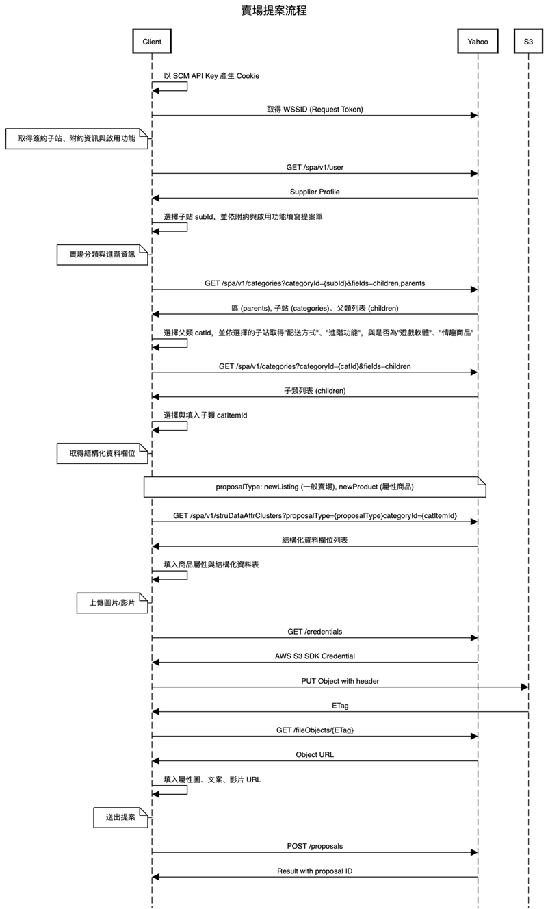

# 20191206

momo類別黨建置 中午成功

欄位整理與

momo窗口對街 確認問題事項



```text
* 程式流程 *
1.至SCM後台取得 API KEY
https://scm.monday.com.tw/ApprovalForm/Query/ApiKeyQuery.aspx
帳號 : 12215548
密碼 : ut91929539
需使用LERK電話號碼驗證 : 0981262533

2.YahooShoppingSCMAPI_request_header加密取得_sp cookie
“App_Code/YahooShoppingSCM_API.Get_YSSCM_CookieCollection()”

3.YahooShoppingSCMAPI_request使用_sp cookie 取 WSSID token
“App_Code/YahooShoppingSCM_API.Get_YSSCM_WSSID_token()”

其餘API利用以上 CookieCollection cookie 與 X-YahooWSSID-Authorization header 作為驗證

4.”YahooShoppingSCM_API.GET_categories_API()”
取回類別項目

5.”YahooShoppingSCM_API.GET_struDataAttrClusters_API()”
取回結構化項目

6.因雅虎資訊安全須將檔案上傳 AWS S3 且只維持一年，一年後需再次上傳
目前圖片上傳採取方式另寫一API功能為將既有圖片網址餵入反傳上傳AWS驗證過後的網址回來。
“App_Code/AmazonUploadFile.vb”

7.上架API為 “App_Code/YahooShoppingSCM_API.POST_proposals_API()” 資料儲存於
“LS3C_V2_2005.YahooshoppingSCM_API_list”
“LS3C_V2_2005.YahooshoppingSCM_API_list_attributes”

8.以上API資料轉存以下相關資料表
相關資料表
1.LS3C_V2_2005.YahooshoppingSCM_API_Category (雅虎購物中心類別查詢)
“App_Code/YahooShoppingSCM_API.GET_categories_API()”
2.LS3C_V2_2005.YahooshoppingSCM_API_struDataAttrClusters (雅虎多重屬性查詢)
“App_Code/YahooShoppingSCM_API.GET_categories_API()”
3.LS3C_V2_2005.YahooshoppingSCM_API_list (用於EC新後台-廠商精技-產品管理資料儲存)
4.LS3C_V2_2005.YahooshoppingSCM_API_list_attributes (用於EC新後台-廠商精技-產品管理資料儲存)

* 流程圖 *
```







月底摳crm

&lt;!--td {border: 1px solid \#ccc;}br {mso-data-placement:same-cell;}--&gt;

|  |  | 2019 | 2020 | 2020 | 2020 | 2020 | 2020 | 2020 | 2020 |
| :--- | :--- | :--- | :--- | :--- | :--- | :--- | :--- | :--- | :--- |
|  |  | 12月 | 1月 | 2月 | 3月 | 4月 | 5月 | 6月 | 7月 |
| 系統支援部 |  |  | AP排程優化開始 錯誤通知信標準化 統一寄送到特定信箱 | 1.每周固定2小時教育訓練開始 2.品牌獨立功能模組化EX.手機驗證 TAPPAY 3.品牌GIT導入 | line 行銷模組系統串接 | line 行銷模組系統串接 | line 行銷模組系統串接 | SQL版本升級規劃 Gitlab-加入持續整合功能，自動測試程式碼編譯是否正確 |  |
| 良興購物網 | 整體優化 | \(秉\)商品頁、分類頁的麵包屑SEO結構優化 |  | 預期2月底前，建置測試環境，EClief前台，API，SQL | .NET CORE 2.0 更新致 2.1 改善具效能疑慮程式碼 | 網購系統帳號驗證機制優化 |  |  |  |
| 會員/APP | \(秉\)會員權益調整 \(偉\)發送簡訊-更改為用API與廠商串接 \(L\)會員補發卡號\(無手機身分為金賺10000筆左右\) \(L\)星奕APP第二階段改版 | 會員中心相關功能修正 |  |  |  |  |  |  |  |
| 商品相關 | \(秉\)紅利加購品項機制調整 | 金賺特價\(紅區\)無黃區時 一般會員可用原價購入 |  |  |  |  |  |  |  |
| 購物流程\(訂單\) |  | 門市取貨訂單 發票存載具 |  |  |  |  |  |  |  |
| 後台 |  |  |  |  |  |  |  |  |  |
| 其他 |  | 良興官方網站 |  |  |  |  |  |  |  |
| 智慧賣 | 前台 | \(偉\)智慧賣前台\_新增呼叫服務員功能 |  |  |  |  |  |  |  |
| 後台 | \(偉\)訂單明細-出貨訊息 \(偉\)訂單明細-新增Search功能 \(偉\)商品設定-新增修改商品項目時，下線商品給予提示 | 總部後台\(ainne\) | 分銷商城\(ainne\) | 分銷商城\(ainne\) |  |  |  |  |  |
| CRM |  | \(K\)1.會員基本標籤功能調整 \(K\)2.Sastty 資料庫串接 \(K\)3.Epson 資料庫串接 \(K\)4. 切換資料庫功能製作 |  |  |  |  |  |  |  |
| ASO |  | \(秉\)會員歸戶 \(秉\)會員資料串接 \(秉\)12/20 開會 | 導入 GIT 版控 | 移機 | 依會員等級給商品價 員購機制 | 門市取貨 貨到付款 | LINE PAY 產品、訂單串接 足履歷 | 商城串接 | 批次區間變價 |
| 全國 |  | \(L\)1.審核權限機制 \(L\)2.首頁logo後台上搞 | 1.新增列印發票功能 2.全國獨立功能文件建立 | 1.後台相關功能優化 |  |  |  |  |  |
| 需求單 |  | \(K\)Sastty 聯盟網串接 \(育\)精技 雅虎scm api串接 \(育\)Momoscm api串接後台 \(育\)需求單電子化 | MSI首頁改版 Sastty電話驗證 StayFun串接 |  |  |  |  |  |  |
| LERK |  | 1.審核權限機制 2.首頁logo後台上搞 3.良興會員資料整理\(補發無手機進賺會員卡號\) | 1.全國新增列印發票功能 |  | EPSON GWP後台優化驗收 |  |  |  |  |
| 秉霖 |  | 1. SEO 優化 2. 會員權益調整 3. 紅利加購品項機制調整 |  |  |  |  |  |  |  |
| 建偉 |  | 智慧賣訂單明細-出貨訊息 智慧賣訂單明細-新增Search功能 智慧賣商品設定-新增修改商品項目時，下線商品給予提示 智慧賣前台\_新增呼叫服務員功能 ECLife發送簡訊-更改為用API與廠商串接 |  | 預期2月底前，建置測試環境，EClief前台，API，SQL |  |  |  | Gitlab-加入持續整合功能，自動測試程式碼編譯是否正確 |  |
| 晴柏 |  | 商城AP優化 全國電子AP優化 精技商品to全國 AP製作 文件建立 Sastty 聯盟網串接 |  |  |  |  |  |  |  |
| 育誠 |  | 精技 雅虎scm api串接 / Momoscm api串接 / 後台需求單電子化 |  |  |  |  |  |  |  |

```text
        2019    2020    2020    2020    2020    2020    2020    2020
        12月    1月    2月    3月    4月    5月    6月    7月
系統支援部        "
"    "AP排程優化開始
錯誤通知信標準化 統一寄送到特定信箱"    "1.每周固定2小時教育訓練開始
2.品牌獨立功能模組化EX.手機驗證 TAPPAY
3.品牌GIT導入"    line 行銷模組系統串接    line 行銷模組系統串接    line 行銷模組系統串接    "SQL版本升級規劃
Gitlab-加入持續整合功能，自動測試程式碼編譯是否正確"    
良興購物網    整體優化    (秉)商品頁、分類頁的麵包屑SEO結構優化        預期2月底前，建置測試環境，EClief前台，API，SQL    ".NET CORE 2.0 更新致 2.1
改善具效能疑慮程式碼"    網購系統帳號驗證機制優化            
    會員/APP    "(秉)會員權益調整
(偉)發送簡訊-更改為用API與廠商串接
(L)會員補發卡號(無手機身分為金賺10000筆左右)
(L)星奕APP第二階段改版"    "會員中心相關功能修正


"                        
    商品相關    (秉)紅利加購品項機制調整    金賺特價(紅區)無黃區時 一般會員可用原價購入                        
    購物流程(訂單)        門市取貨訂單 發票存載具                        
    後台                                
    其他        良興官方網站                        
智慧賣    前台    (偉)智慧賣前台_新增呼叫服務員功能                            
    後台    "(偉)訂單明細-出貨訊息
(偉)訂單明細-新增Search功能
(偉)商品設定-新增修改商品項目時，下線商品給予提示"    總部後台(ainne)    分銷商城(ainne)    分銷商城(ainne)                
CRM        "(K)1.會員基本標籤功能調整
(K)2.Sastty 資料庫串接
(K)3.Epson 資料庫串接
(K)4. 切換資料庫功能製作"                            
ASO        "(秉)會員歸戶
(秉)會員資料串接
(秉)12/20 開會"    導入 GIT 版控    移機    "依會員等級給商品價
員購機制"    "門市取貨
貨到付款"    "LINE PAY 
產品、訂單串接
足履歷"    商城串接    批次區間變價
全國        "(L)1.審核權限機制
(L)2.首頁logo後台上搞"    "1.新增列印發票功能
2.全國獨立功能文件建立"    1.後台相關功能優化                    
需求單        "(K)Sastty 聯盟網串接
(育)精技 雅虎scm api串接
(育)Momoscm api串接後台
(育)需求單電子化"    "MSI首頁改版
Sastty電話驗證
StayFun串接"                        
LERK        "1.審核權限機制
2.首頁logo後台上搞
3.良興會員資料整理(補發無手機進賺會員卡號)"    1.全國新增列印發票功能        EPSON GWP後台優化驗收                
秉霖        "1. SEO 優化
2. 會員權益調整
3. 紅利加購品項機制調整"                            
建偉        "智慧賣訂單明細-出貨訊息
智慧賣訂單明細-新增Search功能
智慧賣商品設定-新增修改商品項目時，下線商品給予提示
智慧賣前台_新增呼叫服務員功能
ECLife發送簡訊-更改為用API與廠商串接
"        預期2月底前，建置測試環境，EClief前台，API，SQL                Gitlab-加入持續整合功能，自動測試程式碼編譯是否正確    
晴柏        "商城AP優化
全國電子AP優化
精技商品to全國 AP製作
文件建立
Sastty 聯盟網串接"                            
育誠        精技 雅虎scm api串接 / Momoscm api串接 / 後台需求單電子化
```



