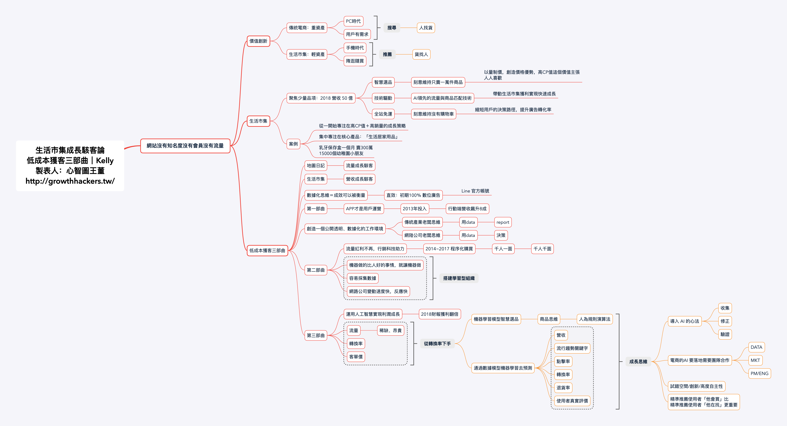
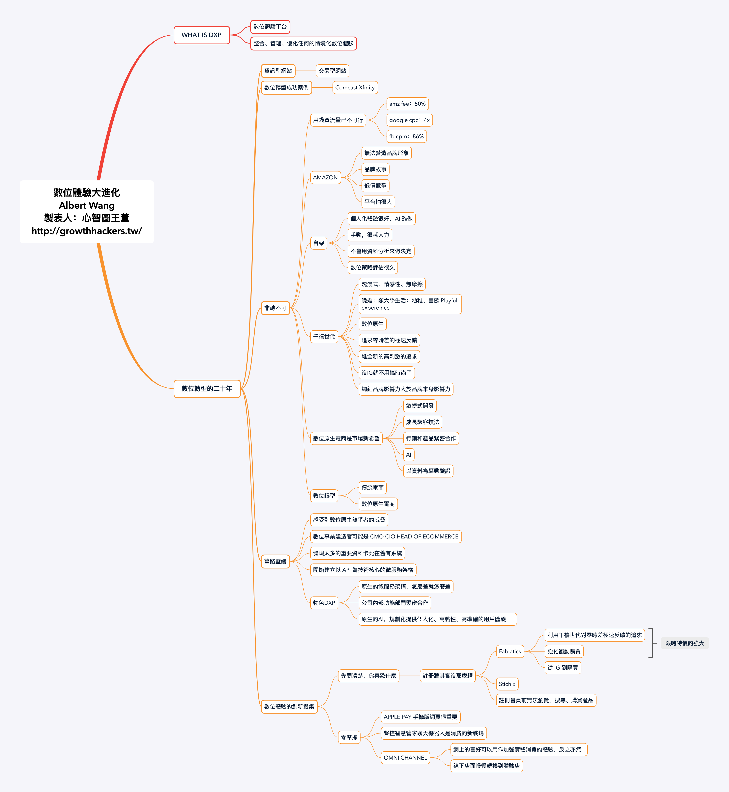
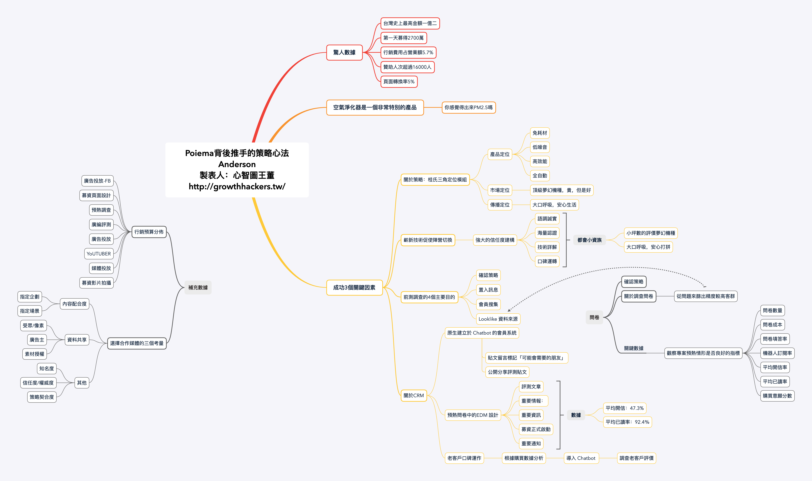
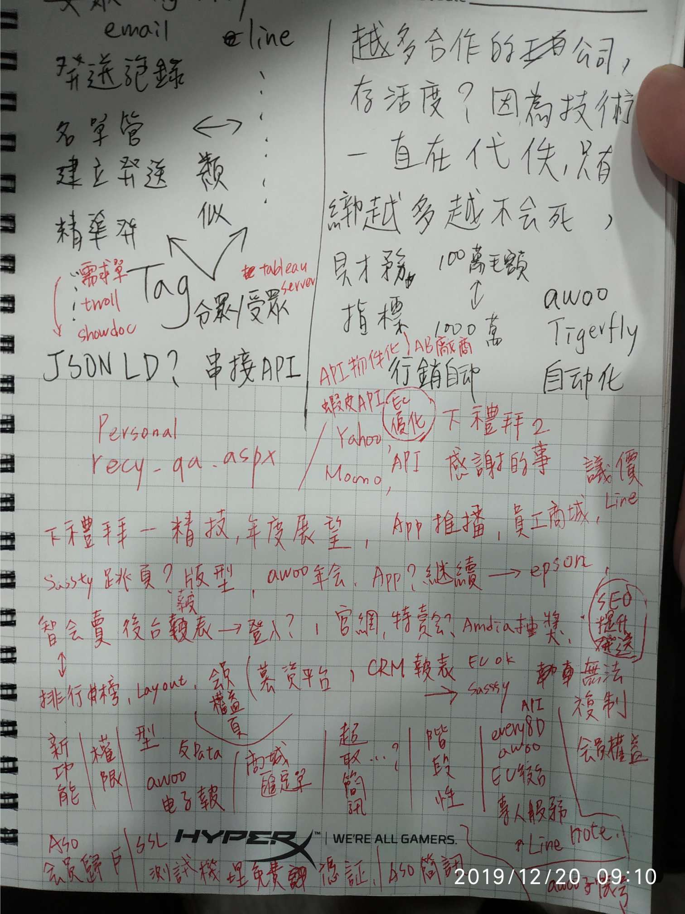

# 20191227

結論是 因為 PK 但又沒辦法一次同時新增三張表資料

所以乾脆直接 三張表變成一張表

需求單 清單 跟 CRUD 跟 DB





any 先提供昨天awoo 成長駭客論壇的mindmap 我在整理筆記給大家～











下禮拜一拿捲尺來量椅子跟桌子高







{% embed url="https://blog.xuite.net/yu928/home/34654987-MS+SQL%E8%87%AA%E5%8B%95%E7%B7%A8%E8%99%9F%28identity%29%E5%8A%9F%E8%83%BD%E6%AD%B8%E9%9B%B6%E7%9A%84%E8%AA%9E%E6%B3%95" caption="" %}

