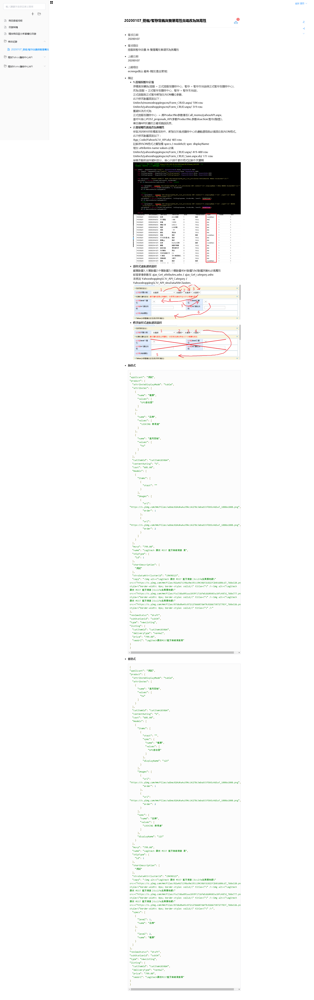

# 20200107

接續昨日修改精技雙層屬性賣場改為單層大致上修改好

接續amy提出的需求單更改內容

欄位異動與圖表內容更改與多一頁簽


從webform直接用ajax要資料會一堆微軟自帶的頁面必須用 ashx 才能回傳乾淨資料

parse解析



































```text
- 需求日期
20200107


- 需求項目
提報與暫存定義 & 雙層屬性賣場改為無屬性


- 上線日期
20200107


- 上線項目
ecmngx後台 廠商-精技[產品管理]


 - 備註
- **1.提報與暫存定義**
原檔案架構為(提報 = 正式提報至購物中心，暫存 = 暫存本地端後正式暫存至購物中心)，
改為(提報 = 正式暫存至購物中心，暫存 = 暫存本地端)，
正式提報與正式暫存差別在JSON欄位參數，
此次修改影響頁面如下 :
Unitech/momoshoppingscm/Form_CRUD.aspx/ 594 row
Unitech/yahooshoppingscm/Form_CRUD.aspx/ 319 row
舊資料流方式為
正式提報至購物中心 -> 將ProductNo參數傳至Call_momo/yahooAPI.aspx，
並呼叫核心POST_proposals_API(參數ProductNo,參數doaction(暫存/驗證))，
會回傳API反饋的正確或錯誤訊息。
- **2.雙層屬性賣場改為無屬性**
保留20200107前檔案至附件，差別在於雅虎購物中心的連動選項與必填項目與JSON格式。
此次修改影響頁面如下 :
App_Code/YahooSCM_API.vb/ 403 row
註解原JSON格式之類別檔 specs / models{0} spec displayName
增加 attribntes name values 必填
Unitech/yahooshoppingscm/Form_CRUD.aspx/ 419-488 row
Unitech/yahooshoppingscm/Form_CRUD_Save.aspx.vb/ 171 row
接著改動前端存資料部分，核心只做不要的格式註解不改邏輯

- **原程式連動選項流程**
館類影響1.大類影響2.中類影響3.小類影響4.lv1影響5.lv2影響其餘6.必填屬性
都需要傳參數至 ajax_Get_attributes.ashx / ajax_Get_category.ashx
表查詢 YahooshoppingSCM_API_Category / YahooshoppingSCM_API_struDataAttrClusters

- **修改後程式連動選項流程**


- **新格式**
```
{
  "applicant": "測試",
  "product": {
    "attributeDisplayMode": "table",
    "attributes": [
      {
        "name": "種類",
        "values": [
          "GPS接收器"
        ]
      },
      {
        "name": "品牌",
        "values": [
          "LOOKING 錄得清"
        ]
      },
      {
        "name": "適用型號",
        "values": [
          "tw"
        ]
      }
    ],
    "catItemId": "catItem103864",
    "contentRating": "G",
    "cost": "605.00",
    "models": [
      {
        "items": [
          {
            "stock": ""
          }
        ],
        "images": [
          {
            "url": "https://s.yimg.com/mm/Files/a6bec824d4a4a394c14270c3ebab33fbb5c465af_1000x1000.png",
            "order": 1
          },
          {
            "url": "https://s.yimg.com/mm/Files/a6bec824d4a4a394c14270c3ebab33fbb5c465af_1000x1000.png",
            "order": 2
          }
        ]
      }
    ],
    "msrp": "799.00",
    "name": "Logitech 羅技 M337 藍牙無線滑鼠 黑",
    "shipType": {
      "id": 1
    },
    "shortDescription": [
      "測試"
    ],
    "struDataAttrClusterId": "19498323",
    "copy": ""
  },
  "reviewStatus": "draft",
  "subStationId": "sub34",
  "type": "newListing",
  "listing": {
    "catItemId": "catItem103864",
    "deliveryType": "normal",
    "price": "799.00",
    "seoUrl": "Logitech羅技M337藍牙無線滑鼠黑"
  }
}
```

- **舊格式**
```
{
  "applicant": "測試",
  "product": {
    "attributeDisplayMode": "table",
    "attributes": [
      {
        "name": "適用型號",
        "values": [
          "tw"
        ]
      }
    ],
    "catItemId": "catItem103864",
    "contentRating": "G",
    "cost": "605.00",
    "models": [
      {
        "items": [
          {
            "stock": "",
            "spec": {
              "name": "種類",
              "values": [
                "GPS接收器"
              ]
            },
            "displayName": "123"
          }
        ],
        "images": [
          {
            "url": "https://s.yimg.com/mm/Files/a6bec824d4a4a394c14270c3ebab33fbb5c465af_1000x1000.png",
            "order": 1
          },
          {
            "url": "https://s.yimg.com/mm/Files/a6bec824d4a4a394c14270c3ebab33fbb5c465af_1000x1000.png",
            "order": 2
          }
        ],
        "spec": {
          "name": "品牌",
          "values": [
            "LOOKING 錄得清"
          ]
        },
        "displayName": "123"
      }
    ],
    "msrp": "799.00",
    "name": "Logitech 羅技 M337 藍牙無線滑鼠 黑",
    "shipType": {
      "id": 1
    },
    "shortDescription": [
      "測試"
    ],
    "struDataAttrClusterId": "19498323",
    "copy": "",
    "specs": [
      {
        "level": 1,
        "name": "品牌"
      },
      {
        "level": 2,
        "name": "種類"
      }
    ]
  },
  "reviewStatus": "draft",
  "subStationId": "sub34",
  "type": "newListing",
  "listing": {
    "catItemId": "catItem103864",
    "deliveryType": "normal",
    "price": "799.00",
    "seoUrl": "Logitech羅技M337藍牙無線滑鼠黑"
  }
}
```
```

