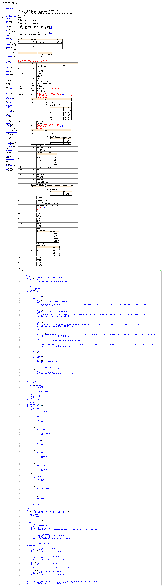

# 20200109

接續昨天 增加 精技 匯入清單權限bug修正

一頁 PAGE ASP.NET 函式庫 內 同一個 FROM 同一個 NAME值 有一筆以上時會自動+ 逗號 ,

{% embed url="https://sweeteason.pixnet.net/blog/post/43525600-chrome-%E9%96%8B%E7%99%BC%E4%BA%BA%E5%93%A1%E5%B7%A5%E5%85%B7-%28devtools-%29%EF%BC%8C%E5%B9%BE%E5%80%8B%E7%B0%A1%E5%96%AE%E5%A5%BD%E7%94%A8" %}











